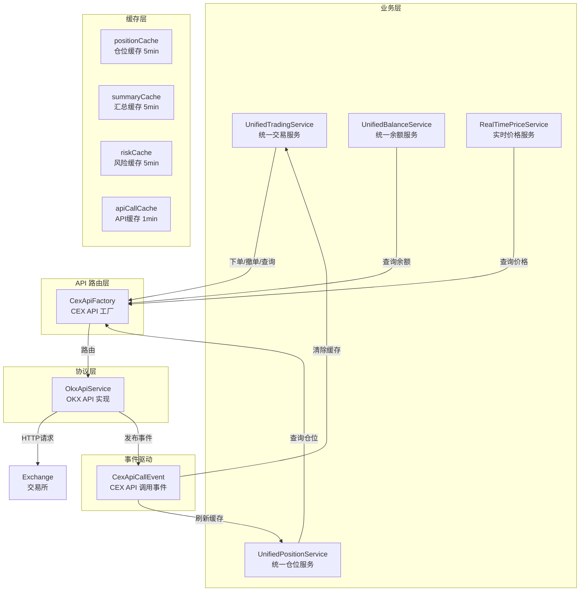
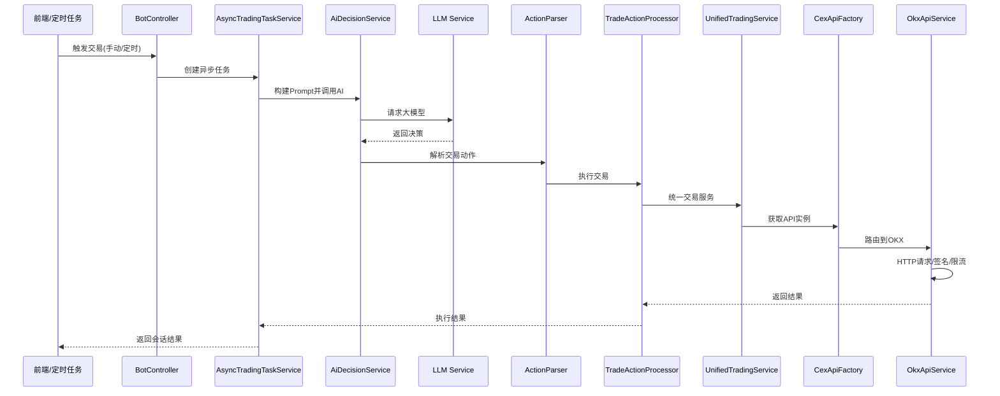

# Crypto Trade System

Crypto Trade System是一个 AI 驱动的加密货币自动交易系统，将大语言模型智能与量化交易实践深度融合，通过赋予 AI 完全的市场分析和交易决策自主权，实现智能化交易。


## ⚠️ 风险警示

> **本项目仅用于技术研究，不构成任何投资建议。**
>
> 加密货币投资是高风险投资行为，项目中涉及的自动化交易策略可能因市场波动、网络延迟、技术缺陷或不可预见因素导致资金损失。
>
> - 进入加密货币市场以前，请确保你已经充分了解相关知识。切记，Not Your Keys, Not Your Coins 
> - 请勿投入您无法承受损失的资金
> - 强烈建议在实盘交易前使用模拟盘充分测试
> - 请确保您已充分了解相关风险并自行承担后果

---
## 📖 系统概述

### 核心功能

*   **📈 实时行情监控**: 集成 TradingView 风格的 K 线图表，支持多种技术指标（MACD, RSI, Bollinger Bands, KDJ 等）。
*   **🤖 AI 智能决策**: 支持 多种 LLM 模型(本地/远端)，自动分析行情并生成交易建议。
*   **🛡️ 风险控制**: 内置多级风控策略（保守、稳健、激进），支持自动止盈止损和仓位管理。
*   **⚡ 自动交易**: 全自动或半自动交易执行，支持限价单、市价单和计划委托。
*   **📊 资产管理**: 实时概览账户权益、持仓状态和历史订单。
*   **🔌 多账户支持**: 安全管理多个 CEX API 密钥（AES-256 加密存储）。

## 🏗️ 系统架构

系统采用典型的前后端分离架构，后端基于 Spring Boot 构建，前端使用 React + Vite。核心业务流程围绕大模型（LLM）调用展开，涵盖从触发、异步任务执行、Prompt 构建、模型调用、结果解析到交易执行的完整闭环。

### 核心模块调用图



### 核心交易流程图



### 事件驱动机制

系统通过 `CexApiCallEvent` 事件实现缓存自动刷新：

1. **API 调用发布事件**: `OkxApiService` 完成 API 调用后发布 `CexApiCallEvent`
2. **缓存刷新**: 监听器接收事件后刷新相关缓存（仓位、余额、持仓等）
3. **缓存过期策略**: 使用 Caffeine 实现本地缓存，默认 TTL 5分钟

## 🛠️ 技术栈

| 分类 | 技术 | 说明 |
|------|------|------|
| **Backend** | Java 17 | 编程语言 |
| | Spring Boot 3.2.0 | Web 框架 |
| | Spring AI | AI 集成 (Ollama) |
| | MySQL 8.0 | 关系型数据库 |
| | Spring Data JPA | ORM 框架 |
| | Caffeine | 本地缓存 |
| | Spring Cache | 缓存抽象 |
| | Spring WebFlux | 响应式编程 |
| | Lombok | 代码简化 |
| | Maven | 构建工具 |
| **Frontend** | React 18 | UI 框架 |
| | TypeScript 5 | 编程语言 |
| | Vite 4 | 构建工具 |
| | Ant Design 5 | UI 组件库 |
| | Zustand | 状态管理 |
| | Axios | HTTP 客户端 |
| | React Router DOM 6 | 路由框架 |

## 🚀 快速开始

### 环境要求
*   **Java**: JDK 17+
*   **Node.js**: v18+ (包含 npm)
*   **Database**: MySQL 8.0+
*   **AI (Optional)**: Ollama (如果需要本地 AI 分析)

### 1. 数据库准备
1.  创建 MySQL 数据库 
2.  执行docs/schema 目录下的脚本。

### 2. 配置属性
创建.env文件，按部署实际配置变量

```yaml
# Database Configuration for Crypto Trade Backend
# MySQL Configuration (comment out if using DuckDB)
CRYPTO_TRADE_DB={your database name}
CRYPTO_TRADE_PASSWD={your database user password}
CRYPTO_TRADE_URL={your database address, eg:localhost:9918}
CRYPTO_TRADE_USERNAME={your database username}
LOG_PATH={log path}
# AI Trading Risk Control Mode
AI_TRADING_RISK_MODE=AUTO
# 是否开启AI自动交易 true/false
AI_TRADING_AUTOMATIC_TRADE_ENABLED=true
```

### 3. 编译
```bash
sh build-all.sh
```

### 4. 启动
```bash
sh start.sh
```
访问 `http://localhost:8080` 进入系统。

## ⚠️ 注意事项
> *   **API Key 安全**: 请确保 CEX API Key 权限最小化（仅交易和读取，**不要开启提现权限**）。
> *   **风险提示**: 加密货币交易风险极高，自动交易系统可能因市场波动、网络延迟或代码缺陷导致资金损失。请在实盘前充分测试。

## 用户指引
参考[《用户指南》](./docs/guides/user-guide.md)
