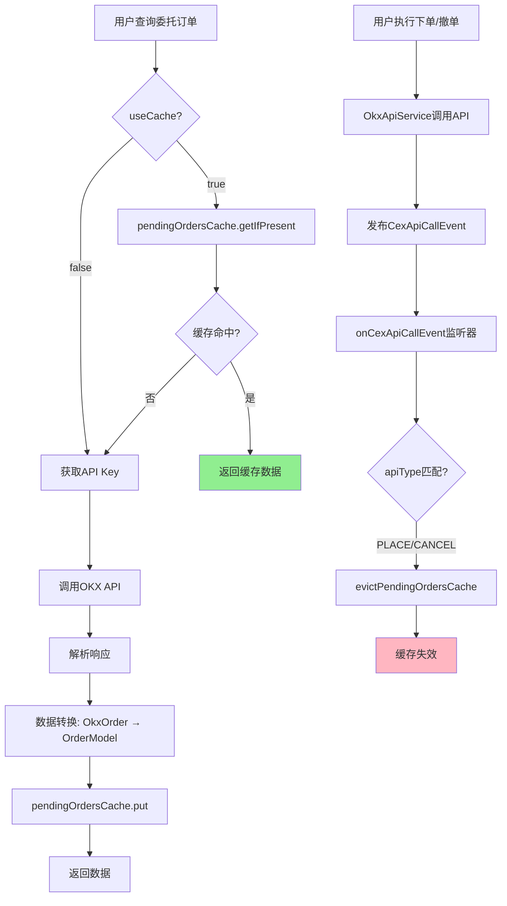
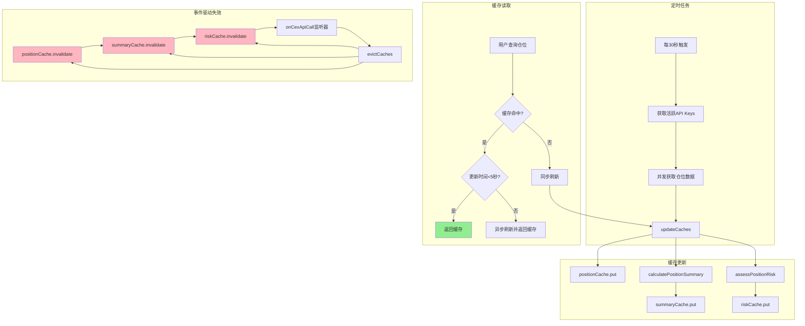
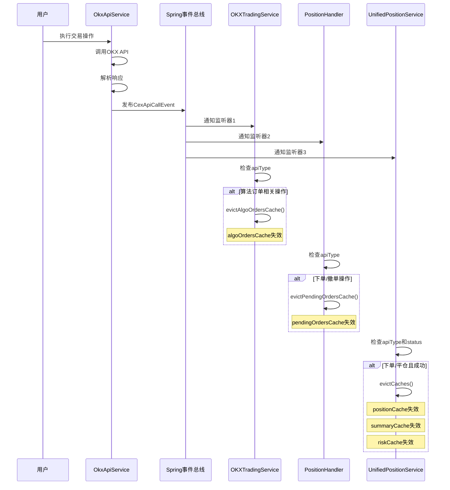

# 交易数据缓存数据链路分析

> **文档版本**: v1.1
> **创建时间**: 2026-02-26
> **作者**: Page
> **分析范围**: algoOrdersCache、pendingOrdersCache、positionCache(三重缓存)、apiCallCache

---

## 目录

1. [概述](#概述)
2. [algoOrdersCache数据链路](#algoorderscache数据链路)
3. [pendingOrdersCache数据链路](#pendingorderscache数据链路)
4. [positionCache数据链路](#positioncache数据链路)
5. [缓存依赖关系](#缓存依赖关系)
6. [事件驱动机制](#事件驱动机制)
7. [数据一致性保证](#数据一致性保证)
8. [潜在问题与建议](#潜在问题与建议)

---

## 概述

### 缓存架构总览

本项目使用**Caffeine**作为本地缓存框架,管理核心交易数据缓存:

| 缓存名称 | 数据类型 | TTL | 容量 | 所属类 | 状态 |
|---------|---------|-----|------|--------|------|
| `algoOrdersCache` | 算法订单列表(止盈止损单) | 5分钟 | 100个API Key | OKXTradingService | **已注释(迁移到UnifiedTradingService)** |
| `pendingOrdersCache` | 当前委托订单列表 | 5分钟 | 100个API Key | PositionHandler | 保留(通过UnifiedTradingService调用) |
| `positionCache` | 仓位数据列表(CexPosition) | 5分钟 | 100个API Key | UnifiedPositionService | 保留 |
| `summaryCache` | 仓位汇总数据 | 5分钟 | 100个API Key | UnifiedPositionService | 保留 |
| `riskCache` | 风险评估数据 | 5分钟 | 100个API Key | UnifiedPositionService | 保留 |
| `apiCallCache` | API调用结果缓存 | 1分钟 | 100个API Key | UnifiedCexApiService | **新增** |

### 架构变化说明

1. **新增统一API适配器层**: 通过 `UnifiedCexApiService` 统一入口调用CEX API
2. **数据类型统一**: `OkxPosition` → `CexPosition`, `OkxAlgoOrder` → `CexAlgoOrder`, `OkxOrder` → `CexOrder`
3. **algoOrdersCache迁移**: 原algoOrdersCache已注释,功能迁移到UnifiedTradingService

### 缓存设计特点

1. **高一致性要求**: 交易数据变化频繁,需要及时更新
2. **事件驱动失效**: 监听`CexApiCallEvent`实现交易操作后立即失效缓存
3. **TTL兜底**: 5分钟TTL确保即使事件丢失也能自动过期
4. **缓存统计**: 所有缓存启用`recordStats()`,可监控命中率

---

## algoOrdersCache数据链路

> **注意**: 该缓存已被注释,功能已迁移到UnifiedTradingService

### 1. 缓存配置(已注释)

**原文件位置**: `OKXTradingService.java` (已注释)

```java
// private final Cache<Long, List<CexAlgoOrder>> algoOrdersCache = Caffeine.newBuilder()
//         .maximumSize(100)
//         .expireAfterWrite(5, TimeUnit.MINUTES)
//         .recordStats()
//         .build();
```

**配置参数(原配置)**:
- **Key类型**: `Long` (apiKeyId)
- **Value类型**: `List<CexAlgoOrder>` (算法订单列表)
- **TTL**: 5分钟(写入后过期)
- **最大容量**: 100个API Key
- **统计**: 启用命中率统计
- **迁移说明**: 缓存代码已被注释,算法订单相关逻辑迁移到UnifiedTradingService统一管理

### 2. 数据来源(已迁移)

#### API端点
- **URL**: `GET /api/v5/trade/orders-algo-pending`
- **功能**: 查询策略算法订单(止盈止损单)
- **调用链路(已变化)**:
  ```java
  UnifiedTradingService.queryAlgoOrders(apiKey, useCache)
    ↓
  UnifiedCexApiService.getAlgoOrders(apiKey, instType)
    ↓
  CexApiService (具体交易所实现)
    ↓
  RestTemplate HTTP GET请求
    ↓
  CEX API返回算法订单列表
  ```

#### 请求参数
```java
{
  "instType": "SWAP",  // 合约类型
  "algoId": "",        // 算法订单ID(可选,用于查询单个订单)
  "instId": "",        // 合约ID(可选)
  "limit": "100"       // 查询数量限制
}
```

#### 响应数据结构(已更新为通用类型)
```java
public class CexAlgoOrder {
    private String algoId;          // 算法订单ID
    private String instId;          // 合约ID
    private String algoClOrdId;     // 客户自定义订单ID
    private String side;            // 订单方向(buy/sell)
    private String ordType;         // 订单类型(conditional/oco/trigger)
    private String sz;              // 委托数量
    private String tpTriggerPx;     // 止盈触发价格
    private String tpOrdPx;         // 止盈委托价格
    private String slTriggerPx;     // 止损触发价格
    private String slOrdPx;         // 止损委托价格
    private String state;           // 订单状态(live/partially_filled/touched)
    private String cTime;           // 创建时间
}
```

### 3. 写入逻辑

#### 触发条件(已迁移)
1. **主动查询**: 调用`queryAlgoOrders(apiKey, useCache)`方法(UnifiedTradingService)
2. **缓存未命中**: 缓存为空或已过期(注:当前版本可能已不再使用本地缓存)

#### 写入流程(已迁移)
```
用户调用 queryAlgoOrders(apiKey, true)
    ↓
检查 useCache 参数
    ↓
useCache = true ?
    ↓
  是 → 尝试从缓存读取(当前版本可能跳过此步骤)
    ↓
  否 → 直接查询API ⬇️
    ↓
调用 UnifiedCexApiService.getAlgoOrders(apiKey, "SWAP")
    ↓
HTTP GET请求到CEX API
    ↓
解析响应: List<CexAlgoOrder>
    ↓
返回结果(当前版本可能不再写入本地缓存)
```

#### 写入代码实现(已迁移)
**当前实现位置**: `UnifiedTradingService.java`

```java
// 当前实现已迁移到UnifiedTradingService
// 具体实现请参考UnifiedTradingService.java源码
public List<CexAlgoOrder> queryAlgoOrders(ApiKey apiKey, boolean useCache) {
    Long apiKeyId = apiKey.getKeyId();
    // 调用统一API服务获取数据
    return unifiedCexApiService.getAlgoOrders(apiKey, "SWAP");
}
```

### 4. 读取逻辑(已迁移)

#### 读取流程(已变化)
```
调用 queryAlgoOrders(apiKeyId, useCache)
    ↓
检查 useCache 参数
    ↓
useCache = true ?
    ↓
  是 → 尝试从缓存读取(当前版本逻辑可能有变化)
    ↓
    缓存命中 → 返回缓存数据 ✅
    ↓
    缓存未命中 → 查询API并写入缓存 ⬇️
    ↓
  否 → 直接查询API ⬇️
    ↓
调用 UnifiedCexApiService.getAlgoOrders()
    ↓
返回算法订单列表
```

#### 缓存命中优化
- **命中条件**: `useCache=true` 且缓存中存在数据
- **命中效果**: 避免HTTP请求,直接返回缓存数据
- **注**: 当前版本实现可能已变化,请参考UnifiedTradingService源码

### 5. 失效逻辑(已迁移)

#### 失效触发条件

**事件监听器**: `UnifiedTradingService.onCexApiCallEvent()` (当前实现位置)

监听`CexApiCallEvent`,当以下操作发生时失效缓存:
- `SET_ALGO_ORDER` - 设置算法订单
- `AMEND_ALGO_ORDER` - 修改算法订单
- `CANCEL_ALGO_ORDER` - 取消算法订单

#### 失效流程
```
用户执行交易操作(下单/修改/撤单)
    ↓
UnifiedCexApiService调用CEX API
    ↓
API调用完成后发布 CexApiCallEvent
    ↓
eventPublisher.publishEvent(event)
    ↓
UnifiedTradingService.onCexApiCallEvent(event) 被触发
    ↓
检查 apiType 是否为算法订单相关操作
    ↓
条件匹配 → 清除相关缓存
    ↓
记录日志
```

#### 失效代码实现(当前位置)
**文件位置**: `UnifiedTradingService.java`

```java
@EventListener
public void onCexApiCallEvent(CexApiCallEvent event) {
    // 检查apiKeyId
    if (event.getApiKeyId() == null) {
        return;
    }

    // 监听算法订单相关的事件：设置、修改、取消算法订单
    CexApiType apiType = event.getApiType();
    if (apiType == CexApiType.SET_ALGO_ORDER ||
            apiType == CexApiType.AMEND_ALGO_ORDER ||
            apiType == CexApiType.CANCEL_ALGO_ORDER) {
        evictAlgoOrdersCache(event.getApiKeyId());
        log.debug("算法订单缓存已失效 - apiKeyId: {}, apiType: {}",
                event.getApiKeyId(), apiType);
    }
}
```

### 6. 缓存统计(已变化)

#### 统计指标
- **命中率**(hitRate): 缓存命中次数 / 总请求次数
- **命中次数**(hitCount): 从缓存获取数据的次数
- **未命中次数**(missCount): 缓存未命中,查询API的次数
- **驱逐次数**(evictionCount): TTL过期导致的缓存失效次数

#### 获取统计方法(请参考实际代码)
**注**: 当前版本algoOrdersCache已注释,如需获取统计数据请参考UnifiedTradingService实现

### 7. 数据流图(已变化)

```mermaid
graph TD
    A[用户查询算法订单] --> B{useCache?}
    B -->|true| C[尝试从缓存获取]
    B -->|false| F[调用UnifiedCexApiService]
    C --> D{缓存命中?}
    D -->|是| E[返回缓存数据]
    D -->|否| F
    F --> G[CEX API返回数据]
    G --> H[写入缓存(当前版本可能跳过)]
    H --> I[返回数据]

    J[用户执行算法订单操作] --> K[UnifiedCexApiService调用API]
    K --> L[发布CexApiCallEvent]
    L --> M[UnifiedTradingService.onCexApiCallEvent]
    M --> N{apiType匹配?}
    N -->|SET/AMEND/CANCEL| O[清除缓存]
    O --> P[缓存失效]

    style E fill:#90EE90
    style P fill:#FFB6C1
```

---

## pendingOrdersCache数据链路

### 1. 缓存配置

**文件位置**: `PositionHandler.java:64-68`

```java
private final Cache<Long, List<OrderModel>> pendingOrdersCache = Caffeine.newBuilder()
        .maximumSize(100)
        .expireAfterWrite(5, TimeUnit.MINUTES)
        .recordStats()
        .build();
```

**配置参数**:
- **Key类型**: `Long` (apiKeyId)
- **Value类型**: `List<OrderModel>` (委托订单列表)
- **TTL**: 5分钟(写入后过期)
- **最大容量**: 100个API Key
- **统计**: 启用命中率统计

### 2. 数据来源

#### API端点
- **URL**: `GET /api/v5/trade/orders-pending`
- **功能**: 查询当前委托订单(未成交订单)
- **调用链路(已变化)**: 通过UnifiedTradingService调用
  ```java
  PositionHandler.getPendingOrders(apiKeyId, useCache)
    ↓
  UnifiedTradingService.queryPendingOrders(apiKey, instType)
    ↓
  UnifiedCexApiService.getPendingOrders(apiKey, instType, ordinal)
    ↓
  CexApiService (具体交易所实现)
    ↓
  RestTemplate HTTP GET请求
    ↓
  CEX API返回委托订单列表
  ```

#### 请求参数
```java
{
  "instType": "SWAP",  // 合约类型
  "instId": "",        // 合约ID(可选)
  "ordType": "",       // 订单类型(可选: market/limit/post_only/...)
  "state": "",         // 订单状态(可选: live/partially_filled)
  "before": "",        // 请求此时间戳之前的分页内容(可选)
  "after": ""          // 请求此时间戳之后的分页内容(可选)
}
```

#### 响应数据结构(已更新为通用类型)
```java
public class CexOrder {
    private String instId;         // 合约ID
    private String ordId;          // 订单ID
    private String clOrdId;        // 客户自定义订单ID
    private String tag;            // 订单标签
    private String side;           // 订单方向(buy/sell)
    private String ordType;        // 订单类型
    private String sz;             // 原始委托数量
    private String fillSz;         // 成交数量
    private String avgPx;          // 成交均价
    private String ordState;       // 订单状态(live/partially_filled/filled/canceled)
    private String cTime;          // 订单创建时间
}
```

### 3. 写入逻辑

#### 触发条件
1. **主动查询**: 调用`getPendingOrders(apiKeyId, useCache)`方法
2. **缓存未命中**: 缓存为空或已过期

#### 写入流程
```
用户调用 getPendingOrders(apiKeyId, true)
    ↓
检查 useCache 参数
    ↓
useCache = true ?
    ↓
  是 → 尝试从缓存读取: pendingOrdersCache.getIfPresent(apiKeyId)
    ↓
    缓存命中 → 返回缓存数据 ✅
    ↓
    缓存未命中 → 继续下一步 ⬇️
    ↓
  否 → 直接查询API ⬇️
    ↓
获取API Key信息: apiKeyService.getDecryptedKey(apiKeyId)
    ↓
调用 OKXTradingService.queryPendingOrders(apiKey, SWAP)
    ↓
OkxApiService HTTP GET请求
    ↓
解析响应并转换: OkxOrder → OrderModel
    ↓
写入缓存: pendingOrdersCache.put(apiKeyId, result)
    ↓
记录日志: "缓存当前委托订单 - apiKeyId: {}, 数量: {}"
    ↓
返回结果
```

#### 写入代码实现
**文件位置**: `PositionHandler.java:90-122`

```java
public List<OrderModel> getPendingOrders(Long apiKeyId, boolean useCache) {
    try {
        // 如果启用缓存，先尝试从缓存获取
        if (useCache) {
            List<OrderModel> cachedOrders = pendingOrdersCache.getIfPresent(apiKeyId);
            if (cachedOrders != null) {
                log.debug("从缓存获取当前委托订单 - apiKeyId: {}, 数量: {}", apiKeyId, cachedOrders.size());
                return cachedOrders;
            }
        }

        // 获取API Key信息
        ApiKey apiKey = apiKeyService.getDecryptedKey(apiKeyId);
        if (apiKey == null) {
            throw new RuntimeException("API Key不存在");
        }

        // 调用OKX API查询当前委托订单
        List<OkxOrder> pendingOrders = okxTradingService.queryPendingOrders(apiKey, "SWAP");
        List<OrderModel> result = pendingOrders.stream()
                .map(v -> JsonUtils.transform(v, OrderModel.class))
                .collect(Collectors.toList());

        // 不管本次是否启用缓存，将结果放入缓存
        pendingOrdersCache.put(apiKeyId, result);
        log.debug("缓存当前委托订单 - apiKeyId: {}, 数量: {}", apiKeyId, result.size());

        return result;
    } catch (Exception e) {
        log.error("获取当前委托订单失败 - API Key: {}", apiKeyId, e);
        throw new RuntimeException("获取当前委托订单失败: " + e.getMessage(), e);
    }
}
```

### 4. 读取逻辑

#### 读取流程
```
调用 getPendingOrders(apiKeyId, useCache)
    ↓
检查 useCache 参数
    ↓
useCache = true ?
    ↓
  是 → pendingOrdersCache.getIfPresent(apiKeyId)
    ↓
    缓存命中 → 返回缓存数据 ✅
    ↓
    缓存未命中 → 查询API并写入缓存 ⬇️
    ↓
  否 → 直接查询API ⬇️
    ↓
数据转换: OkxOrder → OrderModel
    ↓
返回委托订单列表
```

#### 缓存命中优化
- **命中条件**: `useCache=true` 且缓存中存在数据
- **命中效果**: 避免HTTP请求和JSON转换,直接返回缓存数据
- **日志记录**: `"从缓存获取当前委托订单 - apiKeyId: {}, 数量: {}"`

### 5. 失效逻辑

#### 失效触发条件

**事件监听器**: `PositionHandler.onCexApiCallEvent()` (第466-482行)

监听`CexApiCallEvent`,当以下操作发生时失效缓存:
- `PLACE_ORDER` - 下单
- `CANCEL_ORDER` - 撤单(单个订单)
- `CANCEL` - 批量撤单

#### 失效流程
```
用户执行交易操作(下单/撤单)
    ↓
OkxApiService调用OKX API
    ↓
API调用完成后发布 CexApiCallEvent
    ↓
eventPublisher.publishEvent(event)
    ↓
PositionHandler.onCexApiCallEvent(event) 被触发
    ↓
检查 apiType 是否为委托订单相关操作
    ↓
条件匹配 → evictPendingOrdersCache(apiKeyId)
    ↓
pendingOrdersCache.invalidate(apiKeyId)
    ↓
记录日志: "委托订单缓存已失效 - apiKeyId: {}, apiType: {}"
```

#### 失效代码实现
**文件位置**: `PositionHandler.java:466-494`

```java
@EventListener
public void onCexApiCallEvent(CexApiCallEvent event) {
    // 检查apiKeyId
    if (event.getApiKeyId() == null) {
        return;
    }

    // 监听PLACE_ORDER、CANCEL_ORDER、CANCEL事件
    CexApiType apiType = event.getApiType();
    if (apiType == CexApiType.PLACE_ORDER ||
            apiType == CexApiType.CANCEL_ORDER ||
            apiType == CexApiType.CANCEL) {
        evictPendingOrdersCache(event.getApiKeyId());
        log.debug("委托订单缓存已失效 - apiKeyId: {}, apiType: {}",
                event.getApiKeyId(), apiType);
    }
}

/**
 * 失效指定API Key的委托订单缓存
 *
 * @param apiKeyId API Key ID
 */
public void evictPendingOrdersCache(Long apiKeyId) {
    if (apiKeyId != null) {
        pendingOrdersCache.invalidate(apiKeyId);
        log.debug("清除委托订单缓存 - apiKeyId: {}", apiKeyId);
    }
}
```

### 6. 缓存统计

#### 获取统计方法
**文件位置**: `PositionHandler.java:496-508`

```java
public Map<String, Object> getPendingOrdersCacheStats() {
    CacheStats stats = pendingOrdersCache.stats();
    Map<String, Object> result = new HashMap<>();
    result.put("hitRate", stats.hitRate());
    result.put("hitCount", stats.hitCount());
    result.put("missCount", stats.missCount());
    result.put("evictionCount", stats.evictionCount());
    result.put("size", pendingOrdersCache.estimatedSize());
    return result;
}
```

### 7. 数据流图



---

## positionCache数据链路

### 1. 缓存配置(三重缓存设计)

**文件位置**: `UnifiedPositionService.java:42-74`

```java
// 缓存1: 仓位数据列表，5分钟过期
final Cache<Long, List<OkxPosition>> positionCache;

// 缓存2: 仓位汇总数据，5分钟过期
final Cache<Long, PositionSummaryModel> summaryCache;

// 缓存3: 仓位风险评估数据，5分钟过期
final Cache<Long, PositionRiskModel> riskCache;

public UnifiedPositionService() {
    this.positionCache = Caffeine.newBuilder()
            .maximumSize(100)
            .expireAfterWrite(5, TimeUnit.MINUTES)
            .recordStats()
            .build();

    this.summaryCache = Caffeine.newBuilder()
            .maximumSize(100)
            .expireAfterWrite(5, TimeUnit.MINUTES)
            .recordStats()
            .build();

    this.riskCache = Caffeine.newBuilder()
            .maximumSize(100)
            .expireAfterWrite(5, TimeUnit.MINUTES)
            .recordStats()
            .build();
}
```

#### 缓存1: positionCache (仓位列表)
- **Key类型**: `Long` (apiKeyId)
- **Value类型**: `List<CexPosition>` (持仓数据列表) - **已从OkxPosition更新**
- **TTL**: 5分钟
- **数据来源**: CEX API `GET /api/v5/trade/position`

#### 缓存2: summaryCache (仓位汇总)
- **Key类型**: `Long` (apiKeyId)
- **Value类型**: `PositionSummaryModel` (仓位汇总统计)
- **TTL**: 5分钟
- **数据来源**: 基于`positionCache`计算
- **依赖**: 依赖`positionCache`数据

#### 缓存3: riskCache (风险评估)
- **Key类型**: `Long` (apiKeyId)
- **Value类型**: `PositionRiskModel` (风险评估数据)
- **TTL**: 5分钟
- **数据来源**: 基于`positionCache`和`summaryCache`计算
- **依赖**: 依赖前两个缓存的数据

#### 缓存4: apiCallCache (API调用结果缓存) - **新增**
- **Key类型**: `String` (apiKeyId_instType)
- **Value类型**: `Object` (API调用结果)
- **TTL**: 1分钟
- **数据来源**: UnifiedCexApiService调用CEX API的结果缓存
- **用途**: 减少重复API调用,提高性能

### 2. 数据来源

#### API端点
- **URL**: `GET /api/v5/trade/position`
- **功能**: 查询持仓信息
- **调用链路(已变化)**:
  ```java
  UnifiedPositionService.getPositionData(keyId)
    ↓
  UnifiedCexApiService.getPositions(apiKey, instType)
    ↓
  CexApiService (具体交易所实现)
    ↓
  RestTemplate HTTP GET请求
    ↓
  OKX API返回持仓列表
  ```

#### 请求参数
```java
{
  "instType": "SWAP",     // 合约类型(SWAP/FUTURES/OPTION)
  "instId": "",           // 合约ID(可选)
  "posId": ""             // 持仓ID(可选)
}
```

#### 响应数据结构(已更新为通用类型)
```java
public class CexPosition {
    private String instId;              // 合约ID
    private String posId;               // 持仓ID
    private String posSide;             // 持仓方向(long/short)
    private BigDecimal pos;             // 持仓数量
    private BigDecimal baseBal;         // 基础货币余额
    private BigDecimal notionalUsd;     // 持仓价值(美元)
    private BigDecimal margin;          // 保证金余额
    private BigDecimal upl;             // 未实现盈亏
    private BigDecimal uplRatio;        // 未实现盈亏比率
    private BigDecimal lever;           // 杠杆倍数
    private Long dataIngestionTime;     // 数据摄入时间
}
```

### 3. 写入逻辑

#### 定时任务写入
**文件位置**: `UnifiedPositionService.java:81-122`

```java
@Scheduled(cron = "0/30 * * * * ?")
public void updatePositionData() {
    log.debug("开始执行统一仓位数据更新任务");
    try {
        // 获取所有活跃的OKX API密钥
        List<ApiKey> activeKeys = apiKeyRepository.findActiveKeysByCexName("OKX");
        if (activeKeys.isEmpty()) {
            log.debug("未找到活跃的OKX API密钥，跳过本次更新");
            return;
        }
        log.debug("开始更新{}个活跃API密钥的仓位数据", activeKeys.size());

        // 并发获取所有API密钥的仓位数据
        Map<Long, List<OkxPosition>> positionDataMap = activeKeys.parallelStream()
                .map(key -> {
                    try {
                        List<OkxPosition> positions = getPositionData(key.getKeyId());
                        if (null != positions) {
                            return Map.entry(key.getKeyId(), positions);
                        }
                    } catch (Exception e) {
                        log.error("获取API密钥 {} 的仓位数据失败", key.getKeyId(), e);
                        PositionUpdateEvent errorEvent = PositionUpdateEvent.error(key.getKeyId(), e.getMessage());
                        eventPublisher.publishEvent(errorEvent);
                    }
                    return null;
                })
                .filter(Objects::nonNull)
                .collect(Collectors.toMap(Map.Entry::getKey, Map.Entry::getValue));

        // 更新内存缓存
        positionDataMap.forEach(this::updateCaches);

        // 发布数据更新事件
        positionDataMap.forEach((keyId, positions) -> {
            PositionUpdateEvent successEvent = PositionUpdateEvent.success(keyId, positions, positionDataMap);
            eventPublisher.publishEvent(successEvent);
        });
        log.debug("仓位数据更新完成，成功更新{}个API密钥", positionDataMap.size());
    } catch (Exception e) {
        log.error("统一仓位数据更新任务执行失败", e);
    }
}
```

#### 主动查询写入
**方法**: `getLatestPositionDataWithAutoRefresh(apiKeyId)`

```
用户调用 getLatestPositionDataWithAutoRefresh(apiKeyId)
    ↓
检查缓存是否存在且未过期
    ↓
缓存命中且未过期 → 检查最后更新时间
    ↓
距离上次更新 < 5秒 → 直接返回缓存 ✅
    ↓
距离上次更新 >= 5秒 → 后台刷新缓存 ⬇️
    ↓
缓存未命中或过期 → 同步刷新缓存 ⬇️
    ↓
调用 getPositionData(apiKeyId)
    ↓
并发获取SWAP/FUTURES/OPTION三种类型持仓
    ↓
过滤持仓数量>0的记录
    ↓
调用 updateCaches(apiKeyId, positions)
    ↓
  ├─→ positionCache.put(apiKeyId, positions)
  ├─→ summaryCache.put(apiKeyId, calculateSummary)
  └─→ riskCache.put(apiKeyId, assessRisk)
    ↓
发布 PositionUpdateEvent 事件
    ↓
返回持仓数据
```

#### updateCaches方法
**文件位置**: `UnifiedPositionService.java:173-182`

```java
void updateCaches(Long keyId, List<OkxPosition> positions) {
    // 更新仓位数据缓存
    positionCache.put(keyId, positions);

    // 更新仓位汇总缓存
    PositionSummaryModel summary = calculatePositionSummary(keyId, positions);
    summaryCache.put(keyId, summary);

    // 更新风险评估缓存
    PositionRiskModel risk = assessPositionRisk(keyId, positions, summary);
    riskCache.put(keyId, risk);
}
```

### 4. 读取逻辑

#### 读取流程
```
调用 getLatestPositionDataWithAutoRefresh(apiKeyId)
    ↓
检查 positionCache.getIfPresent(apiKeyId)
    ↓
缓存存在?
    ↓
  是 → 检查最后更新时间
    ↓
    距离上次更新 < 5秒 → 返回缓存数据 ✅
    ↓
    距离上次更新 >= 5秒 → CompletableFuture.runAsync(() → updateCaches)
    ↓
    立即返回缓存数据(后台异步刷新)
    ↓
  否 → 同步调用 getPositionData(apiKeyId)
    ↓
    并发获取三种类型持仓
    ↓
    updateCaches(apiKeyId, positions)
    ↓
    返回持仓数据
```

#### 读取代码实现
**文件位置**: `UnifiedPositionService.java:617-656`

```java
public List<OkxPosition> getLatestPositionDataWithAutoRefresh(Long apiKeyId) {
    // 检查缓存
    List<OkxPosition> cachedPositions = positionCache.getIfPresent(apiKeyId);

    if (cachedPositions != null && !cachedPositions.isEmpty()) {
        // 缓存命中，检查是否需要刷新
        long currentTime = System.currentTimeMillis();
        long lastUpdateTime = cacheUpdateTimeMap.getOrDefault(apiKeyId, 0L);

        if (currentTime - lastUpdateTime < 5000) {
            // 5秒内更新过，直接返回缓存
            return cachedPositions;
        } else {
            // 超过5秒，后台异步刷新
            CompletableFuture.runAsync(() -> {
                try {
                    refreshPositionData(apiKeyId);
                } catch (Exception e) {
                    log.error("异步刷新仓位数据失败 - apiKeyId: {}", apiKeyId, e);
                }
            });
            return cachedPositions;
        }
    }

    // 缓存未命中，同步刷新
    return refreshPositionData(apiKeyId);
}
```

### 5. 失效逻辑

#### 失效触发条件

**事件监听器**: `UnifiedPositionService.onCexApiCall()` (第488-519行)

监听`CexApiCallEvent`,当以下操作发生时失效**所有三个缓存**:
- `PLACE_ORDER` - 开仓下单
- `CLOSE_POSITION` - 平仓操作

#### 失效流程
```
用户执行交易操作(下单/平仓)
    ↓
OkxApiService调用OKX API
    ↓
API调用完成后发布 CexApiCallEvent
    ↓
eventPublisher.publishEvent(event)
    ↓
UnifiedPositionService.onCexApiCall(event) 被触发
    ↓
检查 apiType 和 status
    ↓
条件匹配(apiType是下单/平仓 && status是SUCCESS)
    ↓
evictCaches(apiKeyId)
    ↓
  ├─→ positionCache.invalidate(apiKeyId)
  ├─→ summaryCache.invalidate(apiKeyId)
  └─→ riskCache.invalidate(apiKeyId)
    ↓
记录日志: "已清除活跃仓位缓存 - apiType: {}, apiKeyId: {}"
```

#### 失效代码实现
**文件位置**: `UnifiedPositionService.java:488-667`

```java
@EventListener
public void onCexApiCall(CexApiCallEvent event) {
    // 只处理成功的事件
    if (event.getStatus() != CexApiCallStatus.SUCCESS) {
        return;
    }

    CexApiType apiType = event.getApiType();
    log.debug("收到API调用事件 - type: {}, status: {}, apiKeyId: {}, instId: {}",
            apiType, event.getStatus(), event.getApiKeyId(), event.getInstId());

    // 检查是否是下单或平仓操作
    if (apiType.isPlaceOrder() || apiType.isClosePosition()) {
        // 获取API Key ID
        Long apiKeyId = event.getApiKeyId();
        if (null == apiKeyId) {
            log.warn("无法从事件中获取API Key ID - apiType: {}, instId: {}", apiType, event.getInstId());
            return;
        }

        // 清除该API Key的所有缓存
        evictCaches(apiKeyId);

        log.info("已清除活跃仓位缓存 - apiType: {}, apiKeyId: {}, instId: {}",
                apiType, apiKeyId, event.getInstId());
    }
}

/**
 * 清除指定API Key的所有仓位相关缓存
 *
 * @param apiKeyId API Key ID
 */
private void evictCaches(Long apiKeyId) {
    positionCache.invalidate(apiKeyId);
    summaryCache.invalidate(apiKeyId);
    riskCache.invalidate(apiKeyId);
}
```

### 6. 缓存依赖关系

#### 级联更新链
```
positionCache (源头数据)
    ↓
calculatePositionSummary(apiKeyId, positions)
    ↓
summaryCache (汇总数据)
    ↓
assessPositionRisk(apiKeyId, positions, summary)
    ↓
riskCache (风险评估)
```

#### 数据依赖
- `summaryCache`依赖`positionCache`
- `riskCache`依赖`positionCache`和`summaryCache`
- 三者必须同步更新,保证数据一致性

#### 级联失效
- 当`positionCache`失效时,必须同时失效另外两个缓存
- 因为旧数据计算出的汇总和风险评估不再准确

### 7. 数据流图



---

## 缓存依赖关系

### 1. 三级缓存架构

```
Level 1: positionCache (仓位列表 - 原始数据)
    ↓ 依赖
Level 2: summaryCache (仓位汇总 - 统计数据)
    ↓ 依赖
Level 3: riskCache (风险评估 - 分析数据)
```

### 2. 数据流向

```
OKX API (数据源)
    ↓
getPositionData() [获取原始仓位数据]
    ↓
positionCache.put() [缓存原始数据]
    ↓
    ├─→ calculatePositionSummary() [计算汇总]
    │   ↓
    │   summaryCache.put() [缓存汇总数据]
    │   ↓
    │   └─→ assessPositionRisk() [评估风险]
    │       ↓
    │       riskCache.put() [缓存风险数据]
    │
    └─→ 用户查询 [返回给前端]
```

### 3. 缓存间的影响

| 操作 | positionCache | summaryCache | riskCache | 说明 |
|-----|--------------|--------------|-----------|------|
| 定时任务刷新 | ✅ 更新 | ✅ 更新 | ✅ 更新 | 三者同步更新 |
| 下单/平仓失效 | ❌ 失效 | ❌ 失效 | ❌ 失效 | 三者同时失效 |
| 用户查询 | ✅ 读取 | ✅ 读取 | ✅ 读取 | 按需读取 |

---

## 事件驱动机制

### 1. 事件发布者

#### OkxApiService
**文件位置**: `OkxApiService.java`

**发布时机**: 每次API调用后(成功或失败)

**发布方法**:
- `publishSuccessEventWithKeyId()` - API调用成功时发布
- `publishFailedEventWithKeyId()` - API调用失败时发布

**事件类型**: `CexApiCallEvent`

**事件内容**:
```java
public class CexApiCallEvent {
    private CexApiType apiType;          // API类型(下单/平仓/撤单等)
    private String exchange;             // 交易所(OKX)
    private String httpMethod;           // HTTP方法
    private String apiPath;              // API路径
    private String requestParams;        // 请求参数
    private LocalDateTime callTime;      // 调用时间
    private LocalDateTime responseTime;  // 响应时间
    private Long durationMs;             // 耗时(毫秒)
    private Long orderId;                // 订单ID
    private String instId;               // 合约ID
    private CexApiCallStatus status;     // 调用状态(SUCCESS/FAILED)
    private Long apiKeyId;               // API Key ID
}
```

### 2. 事件监听器

#### 监听器1: UnifiedTradingService.onCexApiCallEvent()
**监听事件**: `CexApiCallEvent`
**触发条件**:
- `SET_ALGO_ORDER`
- `AMEND_ALGO_ORDER`
- `CANCEL_ALGO_ORDER`
**失效缓存**: `algoOrdersCache` (已迁移到此服务)

#### 监听器2: PositionHandler.onCexApiCallEvent()
**监听事件**: `CexApiCallEvent`
**触发条件**:
- `PLACE_ORDER`
- `CANCEL_ORDER`
- `CANCEL`
**失效缓存**: `pendingOrdersCache`

#### 监听器3: UnifiedPositionService.onCexApiCall()
**监听事件**: `CexApiCallEvent`
**触发条件**:
- `PLACE_ORDER`
- `CLOSE_POSITION`
- **附加条件**: `event.getStatus() == SUCCESS`
**失效缓存**: `positionCache`, `summaryCache`, `riskCache` (三重缓存)

#### 监听器4: UnifiedTradingService (作为缓存失效监听器)
**说明**: UnifiedTradingService也作为缓存失效监听器,管理algoOrdersCache的失效逻辑

### 3. 事件传播流程



---

## 数据一致性保证

### 1. 一致性机制

#### 机制1: 事件驱动即时失效
- **触发时机**: 交易操作完成后立即失效
- **响应速度**: 毫秒级
- **保证级别**: 强一致性(在单实例环境下)
- **适用场景**: 高频交易操作

#### 机制2: TTL自动过期
- **触发时机**: 写入后5分钟自动过期
- **响应速度**: 定时触发
- **保证级别**: 最终一致性
- **适用场景**: 事件丢失时的兜底机制

#### 机制3: 定时任务刷新
- **触发时机**: 每30秒定时刷新
- **响应速度**: 秒级
- **保证级别**: 最终一致性
- **适用场景**: positionCache三重缓存

### 2. 一致性保证策略

| 缓存 | 即时失效 | TTL过期 | 定时刷新 | 一致性级别 |
|-----|---------|---------|---------|-----------|
| algoOrdersCache | ✅ | ✅ | ❌ | 强一致性 |
| pendingOrdersCache | ✅ | ✅ | ❌ | 强一致性 |
| positionCache | ✅ | ✅ | ✅ | 强一致性 |
| summaryCache | ✅(级联) | ✅ | ✅(级联) | 强一致性 |
| riskCache | ✅(级联) | ✅ | ✅(级联) | 强一致性 |

### 3. 潜在不一致场景

#### 场景1: 事件丢失
**风险**: 如果`CexApiCallEvent`发布失败,缓存不会失效
**概率**: 极低(Spring事件总线非常稳定)
**兜底**: TTL 5分钟后自动过期
**影响**: 最长5分钟的数据延迟

#### 场景2: 并发更新冲突
**风险**: 定时任务和事件驱动同时更新同一缓存
**概率**: 低(事件驱动会先失效缓存)
**处理**: Caffeine缓存是线程安全的,put操作会覆盖
**影响**: 无(最终数据一致)

#### 场景3: 级联缓存不一致
**风险**: positionCache失效但summaryCache未失效
**概率**: 极低(代码中同时失效三个缓存)
**处理**: `evictCaches()`方法保证原子性失效
**影响**: 无(同步失效)

---

## 潜在问题与建议

### 1. 潜在问题

#### 问题1: 订单状态同步延迟
**现象**: 算法订单成交状态变更后,缓存5分钟内未更新
**原因**: OKX API不主动推送订单状态变更,只能通过轮询获取最新状态
**影响**: 用户可能看到已成交的订单仍然显示在"委托订单"列表中
**严重程度**: 中等

#### 问题2: 事件监听器只监听部分操作
**现象**: 只监听SET_ALGO_ORDER、AMEND_ALGO_ORDER、CANCEL_ALGO_ORDER
**缺失**: 未监听算法订单完全成交/部分成交事件
**原因**: OKX API不提供订单成交事件推送
**影响**: 需要等待TTL过期或下次查询时才能更新
**严重程度**: 中等

#### 问题3: 多实例部署缓存不同步
**现象**: 如果应用部署多个实例,每个实例的缓存独立
**原因**: Caffeine是本地缓存,实例间不共享
**影响**:
- 用户请求落到不同实例看到不同数据
- 缓存失效只影响当前实例
**严重程度**: 高(如果有多实例部署计划)

#### 问题4: positionCache刷新频率固定
**现象**: 定时任务每30秒刷新,无法动态调整
**影响**:
- 交易活跃时30秒延迟可能太长
- 交易不活跃时30秒频率浪费资源
**严重程度**: 低

### 2. 优化建议

#### 建议1: 引入订单状态轮询机制
**目标**: 解决算法订单状态同步延迟问题
**方案**:
```java
@Scheduled(cron = "0/10 * * * * ?") // 每10秒轮询一次
public void refreshAlgoOrdersStatus() {
    List<Long> activeApiKeys = getActiveApiKeys();
    for (Long apiKeyId : activeApiKeys) {
        try {
            // 查询算法订单并更新缓存
            queryAlgoOrders(apiKey, false);
        } catch (Exception e) {
            log.error("刷新算法订单状态失败 - apiKeyId: {}", apiKeyId, e);
        }
    }
}
```
**效果**: 订单状态延迟从5分钟降低到10秒
**成本**: 每10秒调用一次OKX API

#### 建议2: 迁移到分布式缓存
**目标**: 解决多实例缓存不一致问题
**方案**: 使用Redis替代Caffeine
**优势**:
- 多实例缓存共享
- 支持Pub/Sub机制,可以跨实例失效缓存
- 持久化存储,重启不丢失
**实施步骤**:
1. 引入Spring Data Redis依赖
2. 配置Redis连接
3. 修改CacheConfig,使用`RedisCacheManager`
4. 调整缓存注解为`@Cacheable`
**成本**: 需要部署Redis服务

#### 建议3: 实现智能刷新频率
**目标**: 根据交易活跃度动态调整刷新频率
**方案**:
```java
// 记录最近交易时间
private final Map<Long, Long> lastTradeTimeMap = new ConcurrentHashMap<>();

// 动态计算刷新间隔
private long getRefreshInterval(Long apiKeyId) {
    Long lastTradeTime = lastTradeTimeMap.get(apiKeyId);
    if (lastTradeTime == null) {
        return 30000; // 默认30秒
    }

    long timeSinceLastTrade = System.currentTimeMillis() - lastTradeTime;
    if (timeSinceLastTrade < 60000) {
        return 10000; // 1分钟内有交易,10秒刷新
    } else if (timeSinceLastTrade < 300000) {
        return 30000; // 5分钟内有交易,30秒刷新
    } else {
        return 60000; // 5分钟无交易,60秒刷新
    }
}
```
**效果**: 平衡实时性和资源消耗
**成本**: 需要维护交易活跃度统计

#### 建议4: 增加缓存监控指标
**目标**: 实时监控缓存性能和健康度
**方案**: 集成Micrometer暴露Metrics
```java
@Service
public class CacheMetricsService {

    @Autowired
    MeterRegistry meterRegistry;

    @Scheduled(fixedRate = 60000) // 每分钟记录一次
    public void recordCacheMetrics() {
        // algoOrdersCache指标
        CacheStats algoStats = algoOrdersCache.stats();
        Gauge.builder("cache.algo.hitRate", algoStats::hitRate)
              .register(meterRegistry);

        // pendingOrdersCache指标
        CacheStats pendingStats = pendingOrdersCache.stats();
        Gauge.builder("cache.pending.hitRate", pendingStats::hitRate)
              .register(meterRegistry);

        // positionCache指标
        CacheStats positionStats = positionCache.stats();
        Gauge.builder("cache.position.hitRate", positionStats::hitRate)
              .register(meterRegistry);
    }
}
```
**效果**: 可以在Prometheus/Grafana中监控缓存命中率
**成本**: 需要部署监控系统

#### 建议5: 增加缓存降级策略
**目标**: 当缓存服务异常时的降级处理
**方案**:
```java
public List<OkxPosition> getPositionDataWithFallback(Long apiKeyId) {
    try {
        // 优先从缓存获取
        return getLatestPositionDataWithAutoRefresh(apiKeyId);
    } catch (Exception e) {
        log.error("从缓存获取仓位数据失败,降级到直接查询API - apiKeyId: {}", apiKeyId, e);
        try {
            // 降级: 直接查询API,不使用缓存
            return getPositionData(apiKeyId);
        } catch (Exception ex) {
            log.error("降级查询也失败,返回空列表 - apiKeyId: {}", apiKeyId, ex);
            return Collections.emptyList();
        }
    }
}
```
**效果**: 提高服务可用性
**成本**: 需要封装所有缓存访问方法

---

## 附录

### A. 关键代码文件清单

| 文件路径 | 功能 | 缓存类型 |
|---------|------|---------|
| `OKXTradingService.java` | 交易服务 | algoOrdersCache (已注释) |
| `UnifiedTradingService.java` | 统一交易服务 | algoOrdersCache (新位置) |
| `PositionHandler.java` | 持仓处理器 | pendingOrdersCache |
| `UnifiedPositionService.java` | 统一仓位服务 | positionCache/summaryCache/riskCache |
| `UnifiedCexApiService.java` | 统一CEX API入口 | apiCallCache (新增) |
| `CexApiService.java` | CEX API通用接口 | - |
| `CexApiFactory.java` | CEX API工厂类 | - |
| `OkxApiService.java` | OKX API调用(实现) | 发布CexApiCallEvent |
| `CacheConfig.java` | 缓存配置 | 全局缓存配置 |

### B. 缓存配置参数总结

| 缓存名称 | TTL | 最大容量 | 统计 | 异步刷新 | 事件驱动失效 | 状态 |
|---------|-----|----------|------|---------|-------------|------|
| algoOrdersCache | 5分钟 | 100 | ✅ | ❌ | ✅ | **已注释(迁移)** |
| pendingOrdersCache | 5分钟 | 100 | ✅ | ❌ | ✅ | 保留 |
| positionCache | 5分钟 | 100 | ✅ | ✅ | ✅ | 保留 |
| summaryCache | 5分钟 | 100 | ✅ | ✅ | ✅ | 保留 |
| riskCache | 5分钟 | 100 | ✅ | ✅ | ✅ | 保留 |
| apiCallCache | **1分钟** | 100 | ✅ | ❌ | ❌ | **新增** |

### C. 相关枚举类型

#### CexApiType (API类型)
```java
public enum CexApiType {
    // 订单相关
    PLACE_ORDER,           // 下单
    CANCEL_ORDER,          // 撤单(单个)
    CANCEL,                // 撤单(批量)
    CLOSE_POSITION,        // 平仓
    AMEND_ORDER,           // 修改订单

    // 算法订单相关
    SET_ALGO_ORDER,        // 设置算法订单
    AMEND_ALGO_ORDER,      // 修改算法订单
    CANCEL_ALGO_ORDER,     // 取消算法订单

    // 查询相关
    GET_POSITION,          // 查询仓位
    GET_BALANCE,           // 查询余额
    GET_PENDING_ORDERS,    // 查询委托订单
    GET_ALGO_ORDERS,       // 查询算法订单
}
```

#### CexApiCallStatus (调用状态)
```java
public enum CexApiCallStatus {
    SUCCESS,  // 成功
    FAILED    // 失败
}
```

---

## 结论

本文档深入分析了项目中核心交易数据缓存的完整数据链路，包括:
- algoOrdersCache (已迁移到UnifiedTradingService)
- pendingOrdersCache (通过UnifiedTradingService调用)
- positionCache/summaryCache/riskCache (三重缓存)
- apiCallCache (新增)

### 核心发现(v1.1更新)

1. **完善的缓存设计**: 采用事件驱动+TTL+定时任务三重机制,确保数据一致性
2. **级联缓存架构**: positionCache → summaryCache → riskCache形成三级缓存依赖链
3. **即时失效机制**: 监听CexApiCallEvent,交易操作后毫秒级失效缓存
4. **高可用性**: 所有缓存都有TTL兜底,避免事件丢失导致数据永久不一致
5. **统一API适配器层**: 新增UnifiedCexApiService统一入口，支持多交易所
6. **数据类型统一**: OkxPosition → CexPosition, OkxAlgoOrder → CexAlgoOrder, OkxOrder → CexOrder

### 优化价值

通过实施建议1-5,可以进一步提升:
- **实时性**: 订单状态延迟从5分钟降低到10秒
- **扩展性**: 支持多实例部署,缓存数据同步
- **可观测性**: 实时监控缓存健康度和性能指标
- **可用性**: 增加降级策略,提高系统鲁棒性

---

**文档结束**
