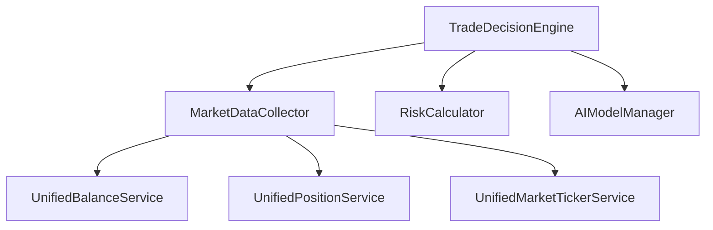
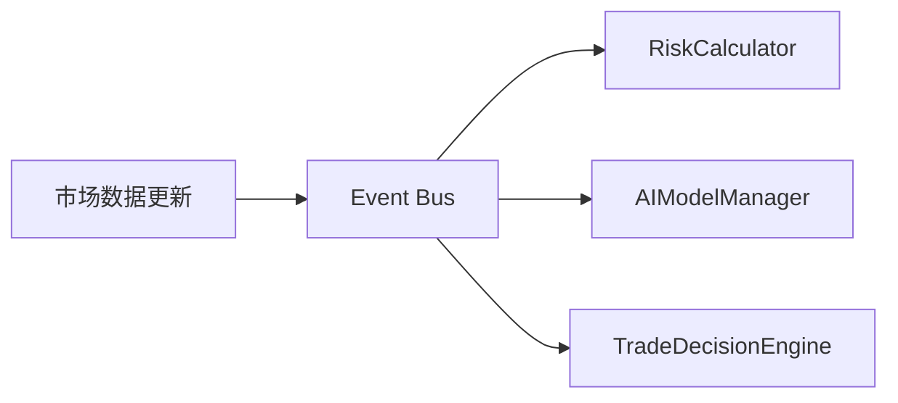
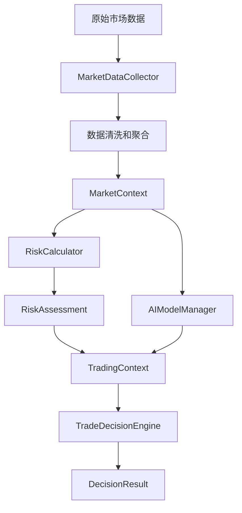

# 加密货币交易系统Service架构概览

## 系统架构概述

本文档描述了加密货币交易系统的整体Service层架构，包括各个服务的职责、依赖关系和交互模式。

## 架构设计原则

### 核心原则
1. **单一职责原则**: 每个Service只负责一个明确的业务领域
2. **依赖控制**: Service依赖数量控制在3-5个以内
3. **低耦合高内聚**: 服务间通过清晰的接口通信
4. **可测试性**: 支持单元测试和集成测试
5. **向后兼容**: 新架构兼容现有功能

### 设计模式
- **决策引擎模式**: 核心业务决策逻辑，协调各组件完成交易决策
- **数据收集器模式**: 市场数据聚合，收集行情、技术指标、市场状况等
- **策略模式**: 风险评估策略，支持动态切换风控模式和交易风格
- **工厂模式**: 统一模型工厂服务实例创建，AI模型调用管理
- **统一服务模式**: 统一封装多交易所API，提供一致的接口抽象

## 核心服务架构

### 1. 决策引擎服务群 (Decision Engine Services)

#### TradeDecisionEngine（交易决策引擎）
```yaml
服务类型: 核心协调服务
依赖数量: 3个
主要职责:
  - 协调各组件完成交易决策
  - 整合市场数据、风险评估和AI模型
  - 做出最终交易决策

依赖服务:
  - MarketDataCollector (市场数据收集)
  - RiskCalculator (风险评估)
  - AIModelManager (AI模型管理)

核心方法:
  - makeDecision() - 标准决策流程
  - makeDecisionWithRisk() - 带风险等级的决策
  - makeQuickDecision() - 快速决策
  - validateDecision() - 决策验证
```

#### MarketDataCollector（市场数据收集器）
```yaml
服务类型: 数据聚合服务
依赖数量: 4个
主要职责:
  - 收集Top30市场数据
  - 收集用户账户和持仓数据
  - 收集技术指标数据
  - 分析市场状况和情绪

依赖服务:
  - UnifiedBalanceService (统一余额服务)
  - UnifiedPositionService (统一持仓服务)
  - UnifiedMarketTickerService (统一行情服务)
  - TechnicalIndicatorService (技术指标服务)

核心功能:
  - 市场状况分析 (牛市/熊市/震荡)
  - 市场情绪分析 (贪婪/恐惧/中性)
  - 市场波动性分析 (高/中/低)
```

#### RiskCalculator（风险计算器）
```yaml
服务类型: 风险评估服务
依赖数量: 0个
主要职责:
  - 计算交易风险评估
  - 分析账户风险敞口
  - 评估资金使用率
  - 识别风险因素

核心算法:
  - 基础风险评分计算
  - 风险等级动态调整
  - 风险因素识别
  - 仓位风险评估
```

#### AIModelManager（AI模型管理器）
```yaml
服务类型: AI模型服务
依赖数量: 0个
主要职责:
  - 管理AI模型调用
  - 格式化决策输入
  - 解析模型输出
  - 生成交易决策

核心功能:
  - AI模型调用管理
  - 决策提示词格式化
  - 快速决策支持
  - 模型统计分析
```

#### AiDecisionService（AI决策服务）
```yaml
服务类型: 核心业务服务
主要职责:
  - 核心AI交易决策服务
  - 整合市场数据、风险评估和AI模型
  - 生成交易决策建议

核心功能:
  - AI决策流程编排
  - 决策结果解析
  - 交易信号生成
```

#### MultiTurnConversationService（多轮对话服务）
```yaml
服务类型: 对话服务
主要职责:
  - 支持复杂决策的多轮对话交互
  - 管理对话上下文
  - 处理用户追问和澄清

核心功能:
  - 对话状态管理
  - 上下文保持
  - 多轮决策支持
```

### 2. 主要业务服务群 (Business Services)

#### ChatService（聊天服务）
```yaml
服务类型: 对话服务
主要职责:
  - 管理用户会话
  - 消息收发
  - 调用统一模型工厂进行对话

核心功能:
  - 会话管理
  - 消息处理
  - 对话生成
```

#### RiskControlService（风控服务）
```yaml
服务类型: 风控管理服务
主要职责:
  - 管理风控模式
  - 管理交易风格
  - 支持动态切换

核心功能:
  - 风控模式配置
  - 交易风格管理
  - 动态参数调整
```

#### BalanceService（余额服务）
```yaml
服务类型: 账户服务
主要职责:
  - 获取CEX账户余额数据
  - 计算余额汇总信息

核心功能:
  - 余额查询
  - 账户汇总
  - 资金分析
```

#### DashboardService（仪表板服务）
```yaml
服务类型: 统计服务
主要职责:
  - 提供活跃任务数统计
  - 提供API Key数量统计
  - 提供系统状态数据

核心功能:
  - 任务统计
  - Key管理统计
  - 系统概览
```

#### PositionQueryService（仓位查询服务）
```yaml
服务类型: 持仓服务
主要职责:
  - 查询所有仓位信息
  - 查询指定合约仓位信息

核心功能:
  - 全仓查询
  - 单币种查询
  - 持仓分析
```

### 3. 交易执行服务群 (Trading Execution Services)

#### TradingOrderService（交易订单服务）- 待优化
```yaml
服务类型: 订单管理服务
依赖数量: 16个 (需要优化)
主要职责:
  - 订单创建和管理
  - 订单执行和监控
  - 交易策略执行
  - 风险控制

待优化方向:
  - 拆分为OrderHandler和PositionHandler
  - 减少依赖数量
  - 提高模块化程度
```

### 4. 数据统一服务群 (Unified Data Services)

#### UnifiedMarketTickerService（统一行情服务）
```yaml
服务类型: 市场数据服务
主要职责:
  - 实时行情数据获取
  - Top30市场ticker聚合
  - 行情数据缓存
  - 多交易所数据整合
```

#### UnifiedBalanceService（统一余额服务）
```yaml
服务类型: 账户数据服务
主要职责:
  - 用户余额查询
  - 账户权益计算
  - 资金使用分析
  - 多账户整合
```

#### UnifiedPositionService（统一持仓服务）
```yaml
服务类型: 持仓数据服务
主要职责:
  - 持仓信息查询
  - 持仓盈亏计算
  - 仓位风险管理
  - 持仓统计分析
```

#### UnifiedTradingService（统一交易服务）
```yaml
服务类型: 交易执行服务
主要职责:
  - 处理市价单
  - 处理限价单
  - 处理止盈止损单

核心功能:
  - 订单创建
  - 订单执行
  - 止盈止损管理
```

#### UnifiedInstrumentService（统一合约信息服务）
```yaml
服务类型: 合约数据服务
主要职责:
  - 合约信息查询
  - 合约参数管理

核心功能:
  - 合约列表查询
  - 合约详情获取
```

#### UnifiedAiTradeService（统一AI交易服务）
```yaml
服务类型: AI交易服务
主要职责:
  - AI交易决策执行
  - 交易信号处理

核心功能:
  - AI信号生成
  - 交易指令下发
```

#### UnifiedCexApiService（统一CEX API服务）
```yaml
服务类型: API集成服务
主要职责:
  - 统一CEX API调用
  - 多交易所API封装

核心功能:
  - API请求封装
  - 响应处理
  - 错误重试
```

#### UnifiedPriceDataService（统一价格数据服务）
```yaml
服务类型: 价格数据服务
主要职责:
  - 价格数据获取
  - 价格历史查询

核心功能:
  - 实时价格
  - 历史价格
```

## 服务交互模式

### 1. 同步调用模式


### 2. 异步事件模式


### 3. 数据流模式


## 数据模型架构

### 核心数据实体

#### MarketContext（市场上下文）
```java
// 市场数据的统一封装
@Data
@Builder
public class MarketContext {
    private String userId;
    private MarketCondition marketCondition;
    private MarketSentiment sentiment;
    private MarketVolatility volatility;
    private List<String> availableSymbols;
    private Map<String, BigDecimal> currentPrices;
    private Map<String, BigDecimal> volume24h;
    private Map<String, BigDecimal> priceChange24h;
    private List<TechnicalIndicator> technicalIndicators;
}
```

#### TradingContext（交易上下文）
```java
// 交易决策的完整上下文
@Data
@Builder
public class TradingContext {
    private String userId;
    private String strategy;
    private RiskLevel riskLevel;
    private MarketContext marketContext;
    private RiskAssessment riskAssessment;
    private LocalDateTime decisionTime;
}
```

#### DecisionResult（决策结果）
```java
// 决策结果的标准化封装
@Data
@Builder
public class DecisionResult {
    private String userId;
    private String strategy;
    private RiskLevel riskLevel;
    private String decision;                    // BUY/SELL/HOLD
    private BigDecimal confidence;
    private String reasoning;
    private List<String> recommendedInstruments;
    private double riskScore;
    private boolean success;
}
```

## 服务治理

### 1. 依赖管理
- 使用Spring的依赖注入机制
- 通过接口隔离降低耦合
- 实现服务发现和注册

### 2. 异常处理
```java
// 统一异常处理策略
@ControllerAdvice
public class ServiceExceptionHandler {
    @ExceptionHandler(ServiceException.class)
    public ResponseEntity<ErrorResponse> handleServiceException(ServiceException e) {
        log.error("Service异常: {}", e.getMessage(), e);
        return ResponseEntity.internalServerError()
                .body(ErrorResponse.builder()
                        .code(e.getErrorCode())
                        .message(e.getMessage())
                        .timestamp(LocalDateTime.now())
                        .build());
    }
}
```

### 3. 性能监控
```java
// 服务性能监控切面
@Aspect
@Component
public class ServiceMonitorAspect {
    @Around("execution(* com.crypto.trade.service..*(..))")
    public Object monitorServicePerformance(ProceedingJoinPoint joinPoint) throws Throwable {
        long startTime = System.currentTimeMillis();
        Object result = joinPoint.proceed();
        long duration = System.currentTimeMillis() - startTime;

        log.info("服务调用: {}.{} 耗时: {}ms",
                joinPoint.getTarget().getClass().getSimpleName(),
                joinPoint.getSignature().getName(),
                duration);

        return result;
    }
}
```

## 配置管理

### Service配置示例
```yaml
# application.yml
crypto:
  trade:
    decision:
      engine:
        enabled: true
        timeout: 5000ms
        retry-count: 3
      risk:
        default-level: NORMAL
        calculation-strategy: ENHANCED
      ai:
        model-name: default-model
        confidence-threshold: 0.7
```

## 部署架构

### 服务部署策略
1. **单实例部署**: 适用于开发和小规模生产环境
2. **多实例部署**: 提高可用性和性能
3. **容器化部署**: 使用Docker进行环境隔离
4. **微服务部署**: 独立部署关键服务

### 服务发现
- 使用Spring Cloud Consul进行服务注册
- 支持服务健康检查
- 实现负载均衡

## 性能指标

### 关键性能指标 (KPI)
```yaml
决策引擎性能:
  - 决策延迟: < 100ms
  - 决策成功率: > 95%
  - 并发处理能力: 1000 QPS

数据收集性能:
  - 数据收集延迟: < 50ms
  - 数据准确性: > 99.9%
  - 数据更新频率: 实时

风险评估性能:
  - 风险计算延迟: < 30ms
  - 风险评估准确性: > 95%
```

## 未来规划

### 短期目标（3个月）
1. 完成TradingOrderService的重构
2. 实现服务的完整监控
3. 优化性能瓶颈

### 中期目标（6个月）
1. 实现微服务架构
2. 添加机器学习模型
3. 扩展支持的交易所

### 长期目标（1年）
1. 实现多策略并行决策
2. 添加量化策略支持
3. 构建完整的交易生态系统

## 总结

本Service架构通过模块化设计、依赖控制和清晰的职责分离，为加密货币交易系统提供了：

1. **高可维护性**: 每个服务职责明确，易于维护
2. **高可扩展性**: 支持新功能和新策略的快速集成
3. **高可靠性**: 通过冗余和容错机制确保系统稳定
4. **高性能**: 通过并行处理和缓存优化提升性能
5. **向后兼容**: 新架构与现有功能无缝集成

这个架构为交易系统的持续发展奠定了坚实的基础。