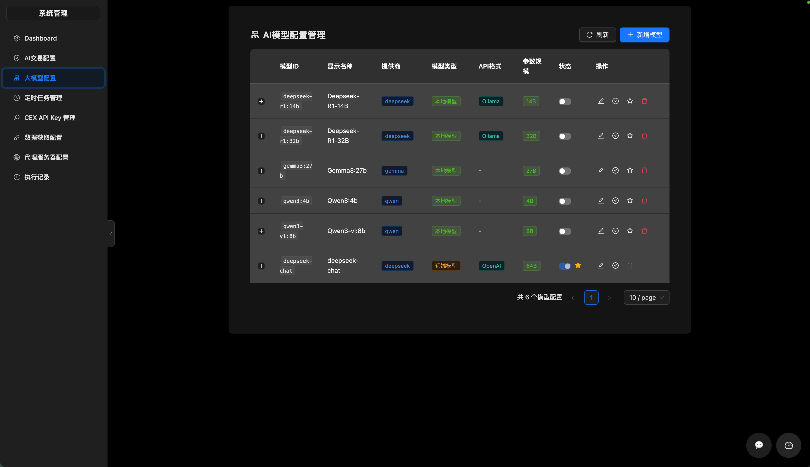
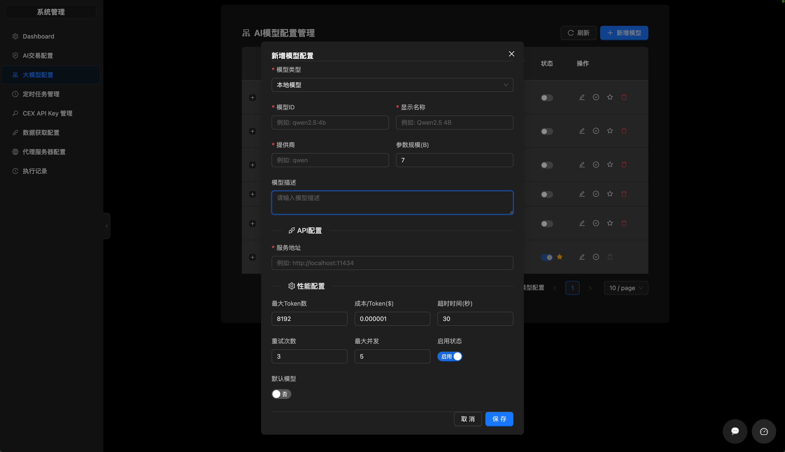
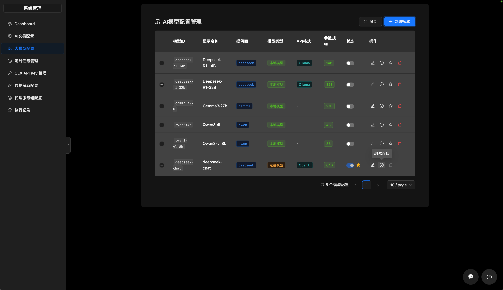

# 大模型配置指南

本指南介绍如何在系统中配置和管理大语言模型（LLM）。

## 访问入口

**页面路径**: `/system/ai-model-configs`

## 功能概述

系统支持配置多种大模型，包括本地模型和远端API模型。

## 操作步骤

### 1. 查看模型列表

进入页面后，默认展示所有已配置的模型列表，包括以下信息：
- 模型ID
- 显示名称
- 提供商
- 模型类型（LOCAL/REMOTE）
- API格式
- 状态（启用/禁用）
- 是否默认

### 2. 添加新模型

1. 点击页面右上角的「新增模型」按钮
2. 填写模型配置表单：

| 字段 | 说明                             | 必填 |
|------|--------------------------------|------|
| 模型ID | 模型的唯一标识，如 `qwen2.5:4b`         | 是 |
| 显示名称 | 友好显示名称                         | 是 |
| 提供商 | 模型提供商名称                        | 是 |
| 模型类型 | LOCAL（本地）或 REMOTE（远端）          | 是 |
| API格式 | deepseek / openai / ollama / 等 | 是 |
| API地址 | API服务地址                        | 是 |
| API密钥 | 访问密钥（加密存储）                     | 否 |
| 最大Token数 | 单次调用最大token数                   | 否 |
| 超时时间（秒） | 请求超时时间                         | 否 |
| 重试次数 | 失败重试次数                         | 否 |
| 最大并发数 | 最大并发请求数                        | 否 |
| 额外请求参数 | JSON格式的额外参数                    | 否 |

3. 点击「保存」保存配置

### 3. 编辑模型配置

1. 在模型列表中找到需要编辑的模型
2. 点击操作列的「编辑」按钮
3. 修改相应字段
4. 点击「确定」保存更改

### 4. 删除模型

1. 在模型列表中找到需要删除的模型
2. 点击操作列的「删除」按钮
3. 确认删除操作

> 注意：删除操作采用软删除方式，模型数据不会真正删除，只是设置为不活跃状态。

### 5. 设置默认模型

1. 在模型列表中找到需要设为默认的模型
2. 点击操作列的「设为默认」按钮
3. 系统会更新默认模型标记

> 注意：全系统只能有一个默认模型。

### 6. 启用/禁用模型

1. 在模型列表中找到需要操作的模型
2. 点击状态开关切换启用/禁用状态
3. 禁用后该模型将不会参与AI决策

### 7. 测试模型连接

1. 在模型列表中找到需要测试的模型
2. 点击操作列的「测试连接」按钮
3. 系统会尝试连接模型服务
4. 返回连接结果（成功/失败及错误信息）

## 模型类型说明

### 本地模型（LOCAL）

使用本地部署的模型服务，如 Ollama。

**配置要求**:
- API格式选择 `ollama`
- API地址填写本地服务地址，如 `http://localhost:11434`

### 远端模型（REMOTE）

使用第三方API服务，如 OpenAI、Anthropic Claude 等。

**配置要求**:
- API格式选择对应的格式（openai/claude/custom）
- API地址填写服务商提供的API地址
- 需要填写API密钥

## 常见问题

### Q: 如何判断模型是否可用？
A: 查看模型状态是否为「启用」，并使用「测试连接」功能验证。

### Q: 可以同时使用多个模型吗？
A: 可以，系统支持配置多个模型，通过设置默认模型来指定主用模型。

### Q: API密钥安全吗？
A: 是的，API密钥在数据库中采用加密存储，前端显示时会进行脱敏处理。
