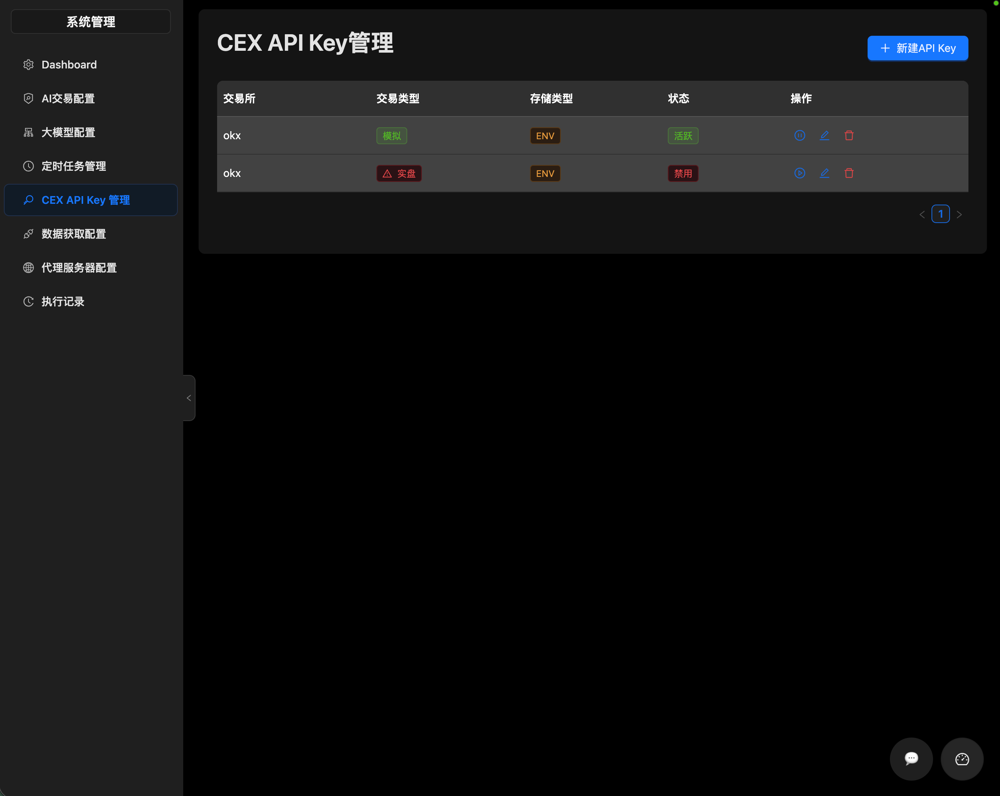
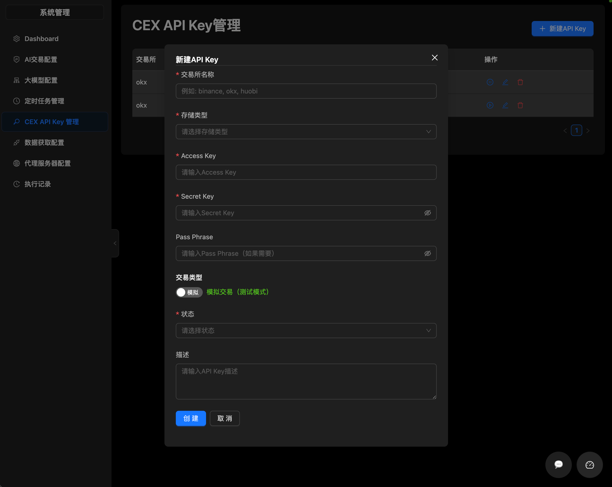

# CEX API Key 管理指南

本指南介绍如何在系统中管理交易所（CEX）的 API Key。

## 访问入口

**页面路径**: `/system/cex-keys`

## 功能概述

系统支持添加和管理多个交易所的 API Key，用于执行交易操作。支持两种存储方式：数据库加密存储和环境变量引用。

## 操作步骤

### 1. 查看 API Key 列表

进入页面后，默认展示所有已配置的 API Key，包括以下信息：
- 交易所名称
- 存储类型（DB/ENV）
- 状态（启用/禁用）
- 实盘/模拟盘标识
- 创建时间
- 描述

> 注意：出于安全考虑，API Key 的密钥内容不会在列表中直接显示。

### 2. 添加新的 API Key

1. 点击页面右上角的「新增 API Key」按钮
2. 填写 API Key 配置表单：

| 字段 | 说明 | 必填 |
|------|------|------|
| 交易所 | 选择交易所类型（如 OKX） | 是 |
| Access Key | API Access Key | 是 |
| Secret Key | API Secret Key | 是 |
| Pass Phrase | 交易密码（可选，部分交易所需要） | 否 |
| 存储类型 | DB（数据库）或 ENV（环境变量） | 是 |
| 环境变量名 | 存储类型为ENV时指定 | 否 |
| 描述 | 备注说明 | 否 |

3. 点击「确定」保存配置

**存储类型说明**:
- **DB 模式**: API Key 加密存储在数据库中
- **ENV 模式**: 仅存储环境变量名称，从系统环境变量读取实际值（更安全）

### 3. 编辑 API Key 配置

1. 在 API Key 列表中找到需要编辑的项
2. 点击操作列的「编辑」按钮
3. 修改相应字段
4. 点击「确定」保存更改

> 注意：编辑时需要重新输入密钥内容。

### 4. 删除 API Key

1. 在 API Key 列表中找到需要删除的项
2. 点击操作列的「删除」按钮
3. 确认删除操作

### 5. 启用/禁用 API Key

1. 在 API Key 列表中找到需要操作的项
2. 点击状态开关切换启用/禁用状态
3. 禁用后该 API Key 将无法用于交易

### 6. 查看密钥详情

1. 在 API Key 列表中找到需要查看的项
2. 点击操作列的「查看」按钮
3. 系统会解密并显示密钥详情

> 安全提示：密钥详情会在 30 秒后自动隐藏。

### 7. 切换实盘/模拟盘

1. 在 API Key 列表中找到需要操作的项
2. 点击「切换实盘/模拟盘」按钮
3. 系统会弹出风险提示，确认后切换

> 警告：切换到实盘模式后将使用真实资金进行交易，请谨慎操作。

## 常见问题

### Q: API Key 存储在哪里更安全？
A: 建议使用 ENV 模式，密钥存储在环境变量中，不存入数据库。即使数据库被攻破，也无法获取实际密钥。

### Q: 为什么我的 API Key 无法交易？
A: 请检查以下项目：
1. API Key 是否已启用
2. API Key 是否具有交易权限
3. 交易所网络是否可访问
4. 实盘/模拟盘模式是否正确

### Q: 可以同时管理多个交易所的 API Key 吗？
A: 可以，系统支持添加多个不同交易所的 API Key。

### Q: API Key 密钥会泄露吗？
A: 不会。数据库中存储的是加密后的密钥，前端显示时会进行脱敏处理（如显示 `ak****3d`）。
