# 合约交易指南

本指南介绍如何在系统中进行合约（永续合约）交易操作。

## 访问入口

**交易页面**: `/trading`
**持仓列表**: `/positions`

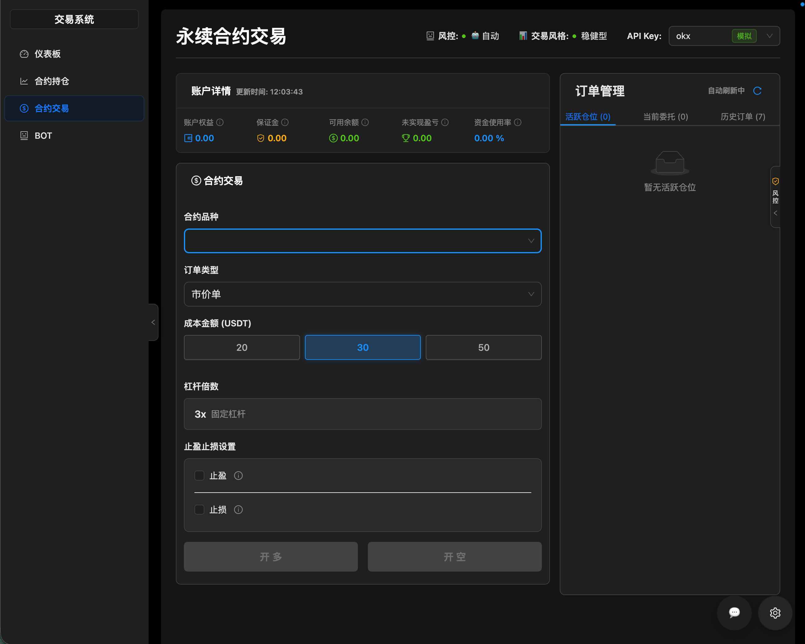

## 功能概述

系统支持以下合约交易功能：
- 开仓（做多/做空）
- 平仓（市价/限价）
- 止盈止损设置
- 持仓管理

## 开仓交易

### 操作步骤

1. 进入交易页面
2. 选择交易品种（Top30 永续合约）
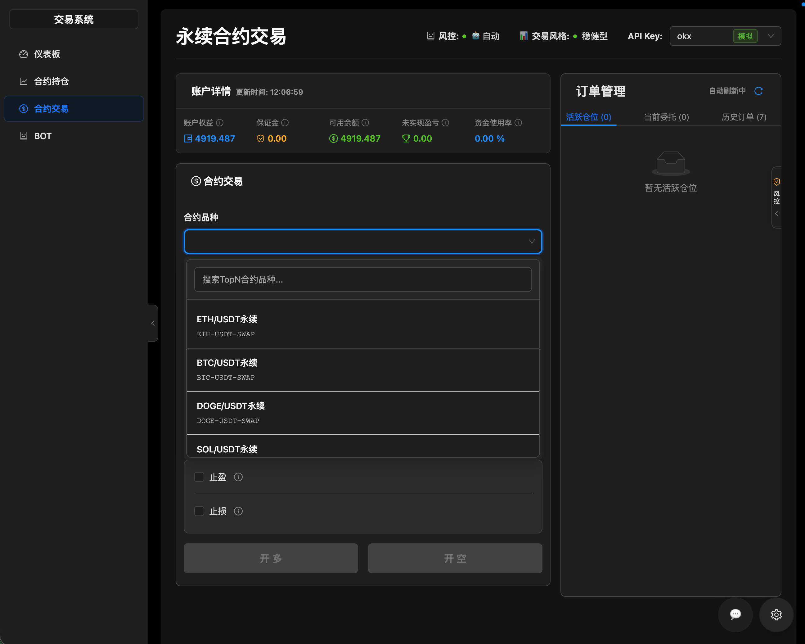
3. 选择 API Key（用于执行交易，一般情况下，进入页面时，第一个可用的api key会被默认选中）
4. 选择订单类型：
   - **市价单**: 以当前市场价格立即成交
   - **限价单**: 以指定价格挂单成交
5. 选择交易方向：
   - **做多（Buy）**: 买入开多
   - **做空（Sell）**: 卖出开空
6. 选择成本金额（预设金额快速选择）
   - 系统提供 20 / 30 / 50  USDT 三个预设选项，不支持手动输入金额。 
7. （可选）设置止盈止损：
   - 止盈：达到目标价格自动平仓获利
   - 止损：达到止损价格自动平仓止损
   - 止盈和止损可单独设置，也可同时设置

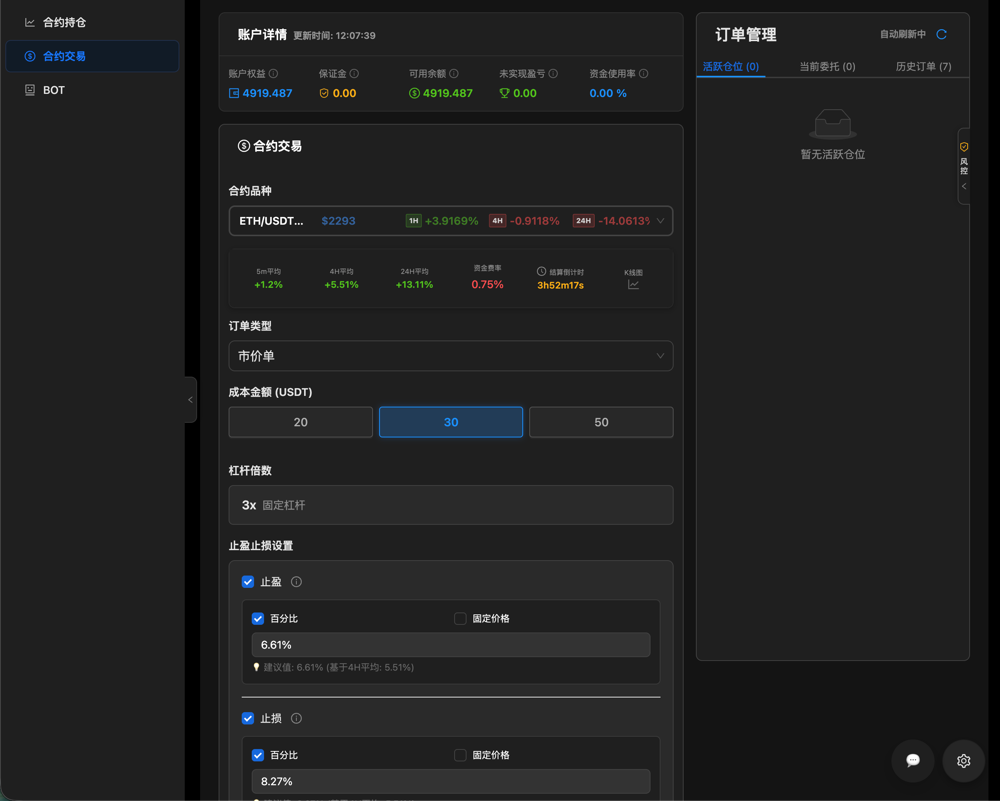
 > 系统会根据历史数据，自动填充建议的止盈止损值。

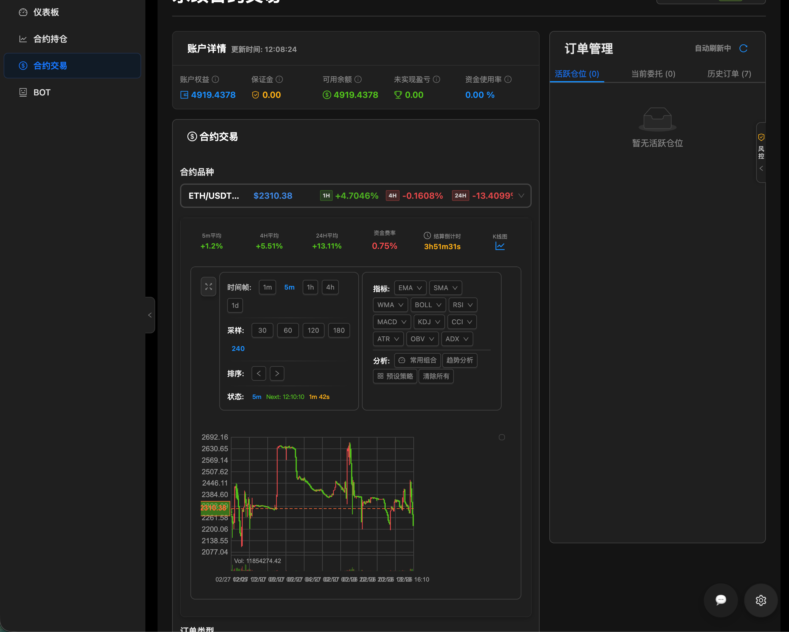
8. 点击「开多」或「开空」按钮
9. 在弹出的确认对话框中确认交易信息
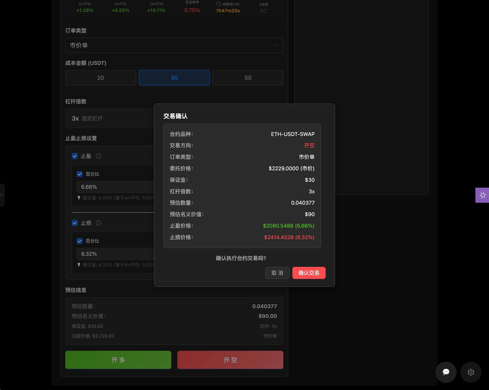
10. 点击「确认」提交订单

## 平仓交易

### 操作步骤

1. 在持仓列表页面
2. 找到需要平仓的持仓
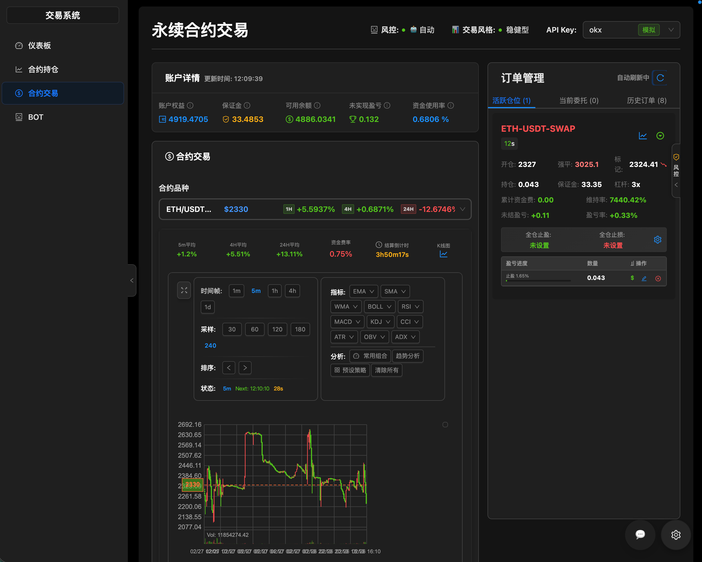
3. 点击「平仓」按钮
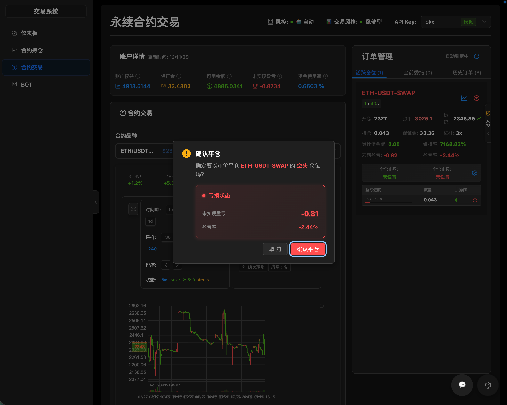
4. 在弹出的平仓窗口中确认平仓信息
5. 点击「确认平仓」

## 止盈止损管理

### 设置止盈止损

在开仓时可以设置止盈止损，也可以在持仓列表中单独设置：

1. 找到需要设置的持仓
2. 点击「设置止盈止损」按钮
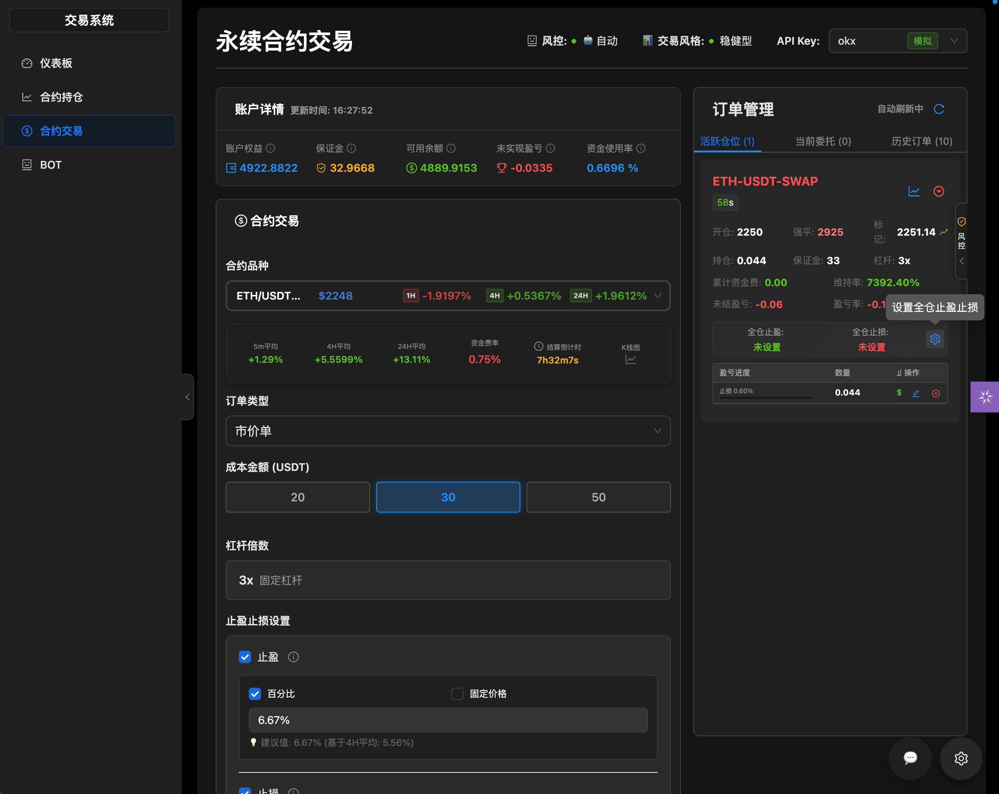
3. 设置止盈价格和/或止损价格（可单独设置，也可同时设置）
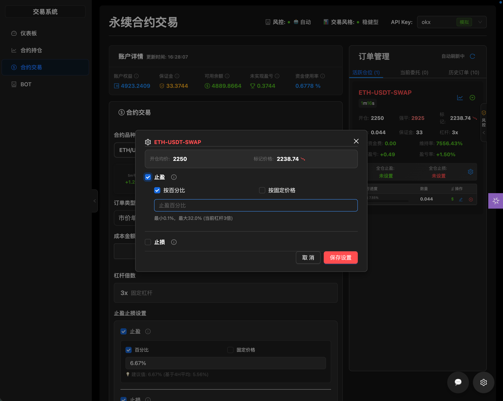
4. 点击「保存设置」

### 修改止盈止损

1. 找到已有止盈止损设置的持仓
2. 点击「设置止盈止损」按钮
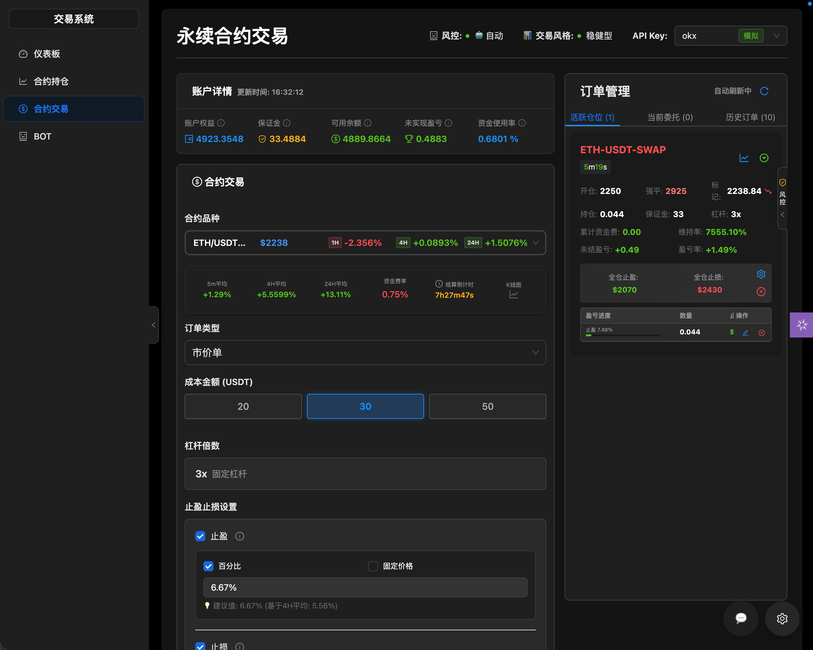
3. 修改价格
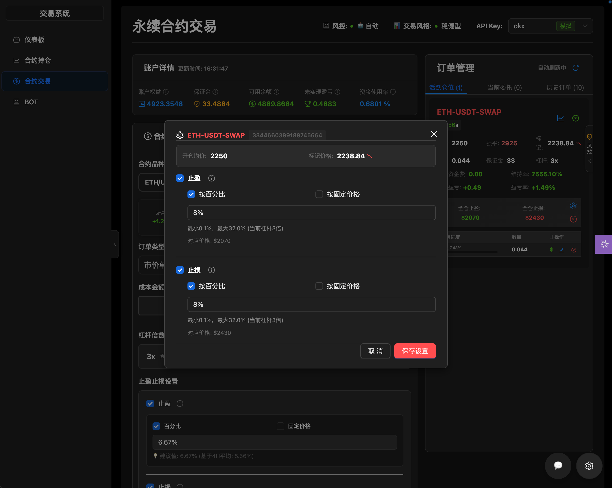
4. 点击「保存设置」

### 取消止盈止损

1. 找到已有止盈止损设置的持仓
2. 点击「撤销止盈止损策略」
3. 确认取消操作

## 常见问题

### Q: 开仓数量是如何计算的？
A: 开仓张数 = (成本金额 × 杠杆) / (当前价格 × 合约面值)

### Q: 为什么无法开仓？
A: 请检查以下项目：
1. API Key 是否已配置且可用
2. 账户余额是否充足
3. 网络连接是否正常

### Q: 止盈止损一定会成交吗？
A: 止盈止损使用条件单，在市场价格达到触发价格时触发。但可能在极端行情下出现滑点。

### Q: 市价单和限价单有什么区别？
A: 市价单以当前最优价格立即成交，成交速度快但价格不确定；限价单需要指定价格，可能不成交但价格可控。
