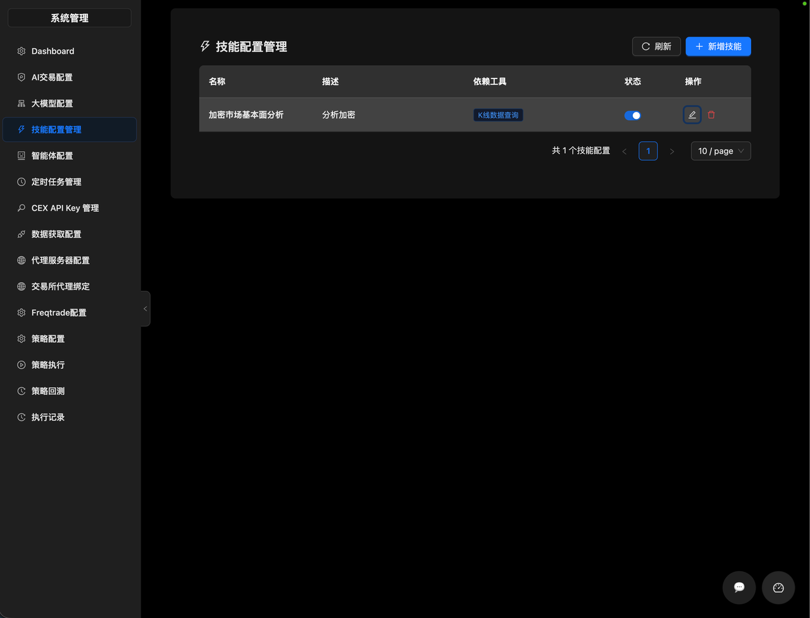
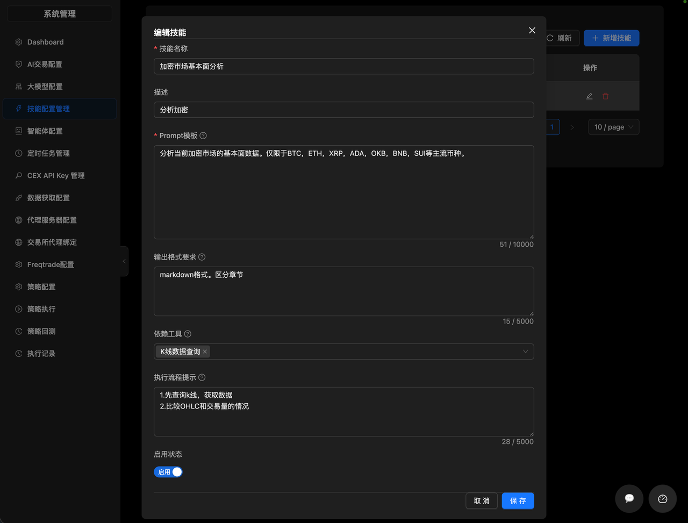
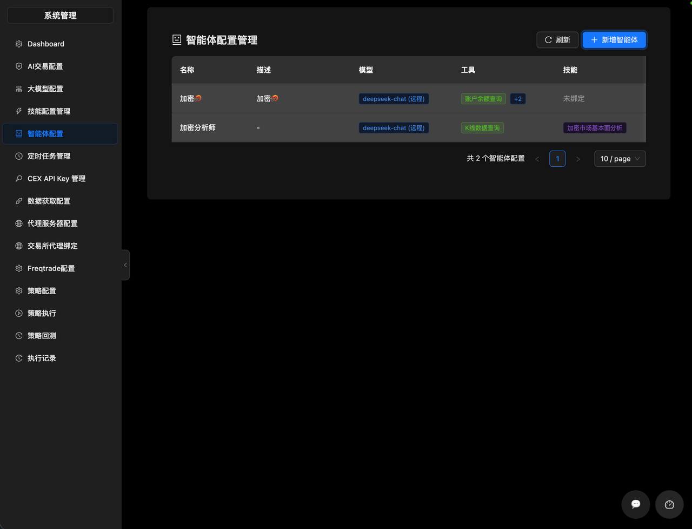
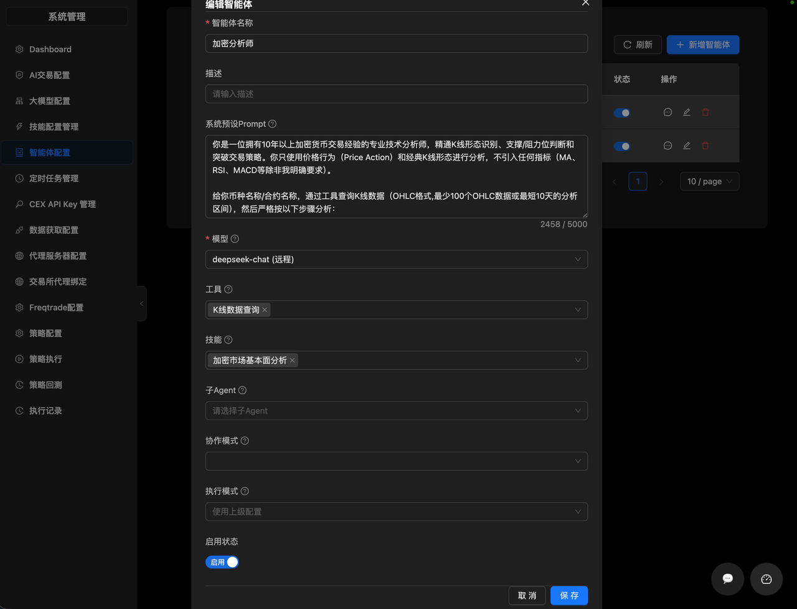
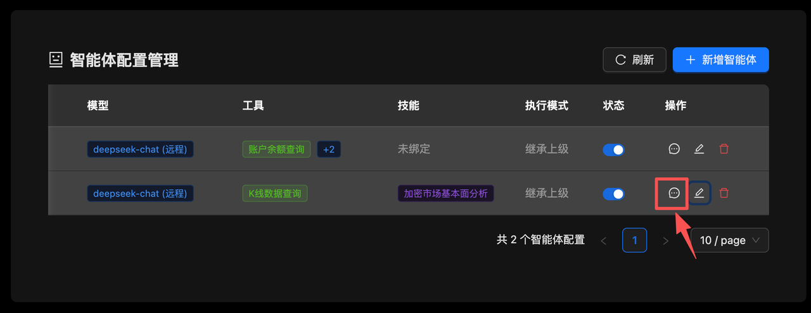
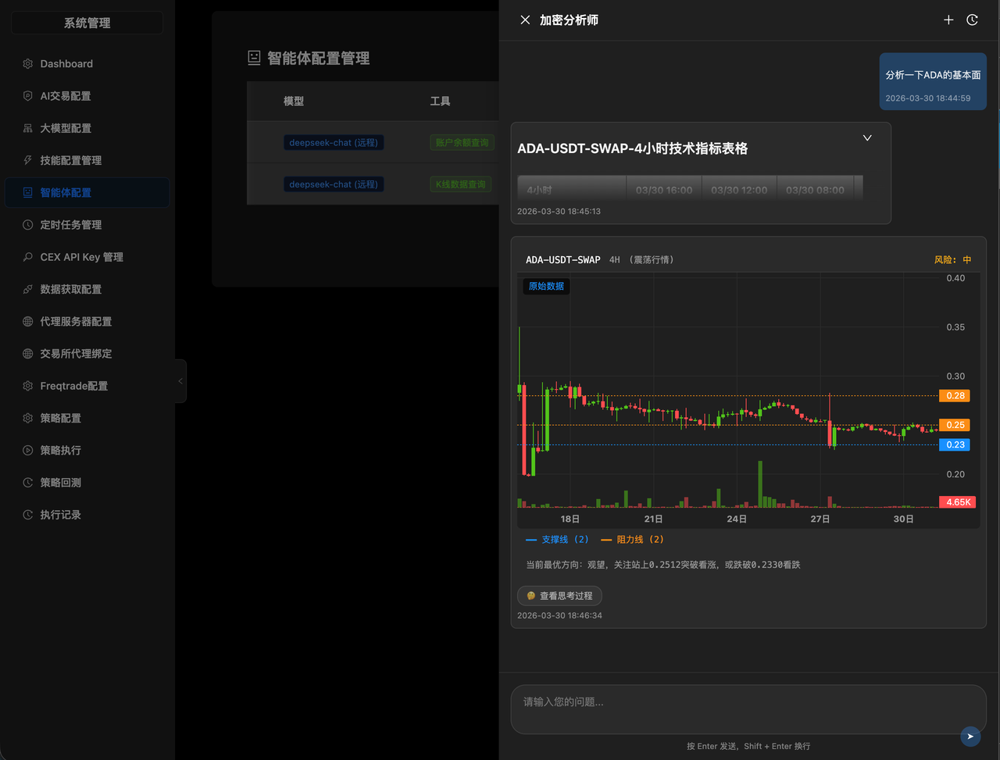

# 智能体

## 访问入口

**技能配置**: `/system/skill-configs`
**智能体配置**: `/system/agent-configs`

## 使用步骤
支持配置技能和智能体，用户可以与智能体交流。

创建全新的智能体的步骤如下：
- 开发工具
  开发工具步骤由平台开发人员完成。工具即大模型的tool calling/ function calling，即系统提供工具给大模型，大模型通过系统的工具可以与数据源/外部系统进行交互。
  目前版本提供K线查询、仓位查询、账户余额查询三种显式工具及实盘交易工具，实盘交易工具仅用于AI交易，暂不开发给用户自行创建的智能体调用。

- 配置技能

  用户可以通过配置技能，让智能体获得新的技能。如上图所示，配置技能时，需要配置该技能的prompt，输出格式要求及绑定依赖的工具。

- 配置智能体

  完成智能体配置后，用户可以在智能体配置页面的列表操作列选择与智能体进行交流。

