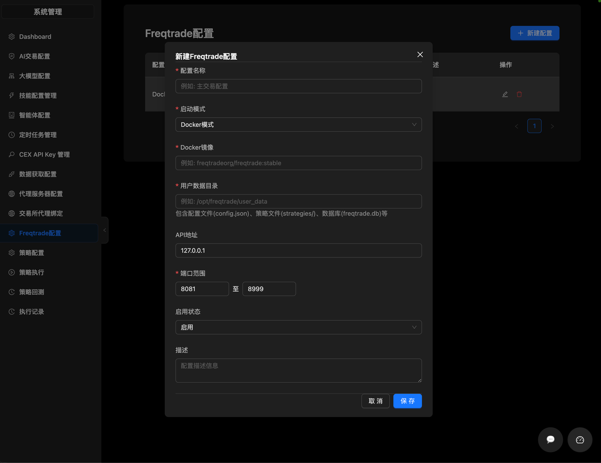
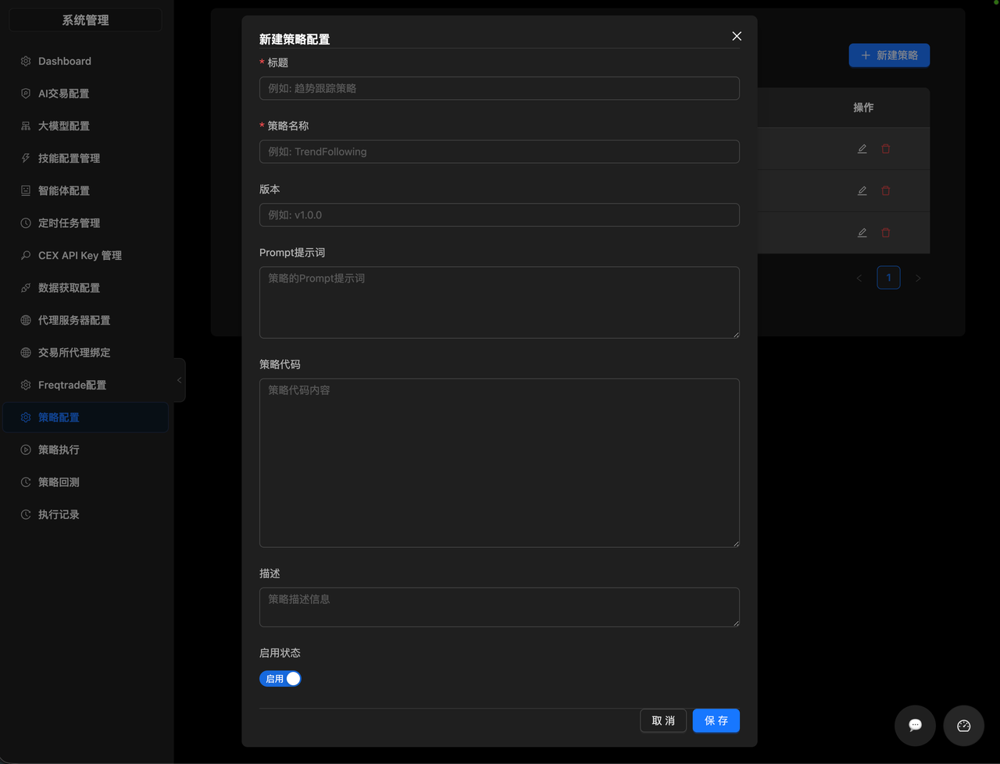
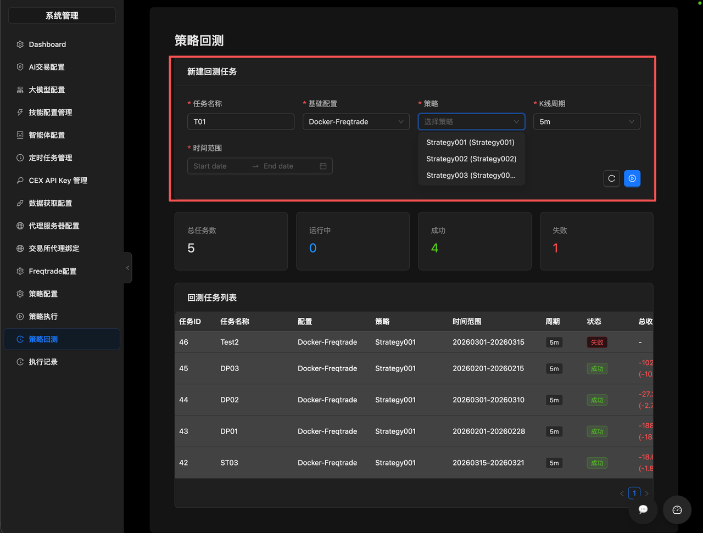
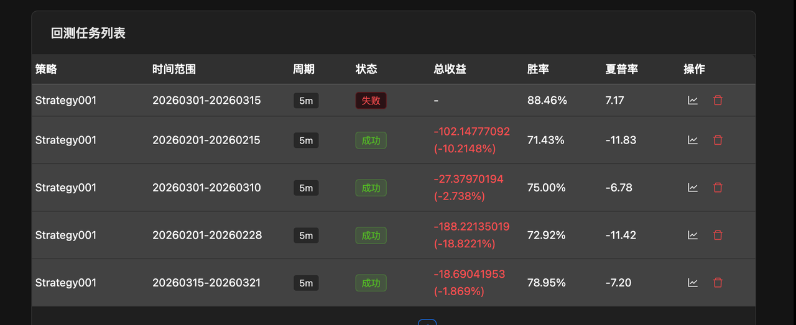
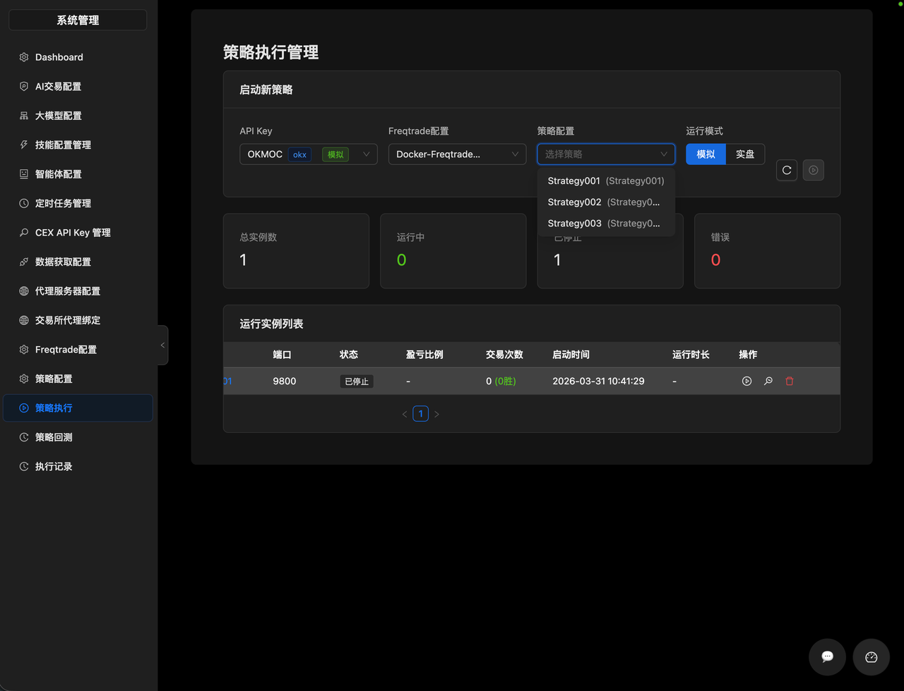
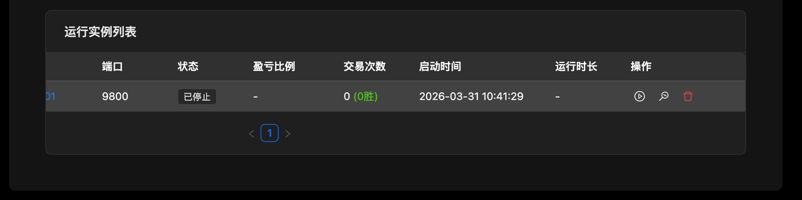
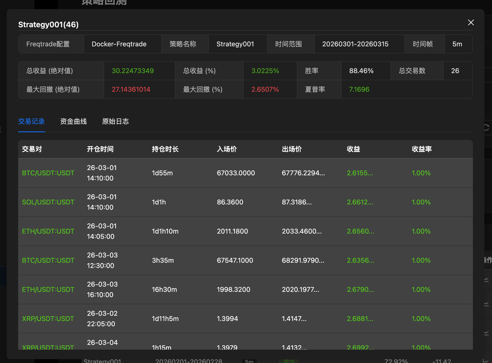
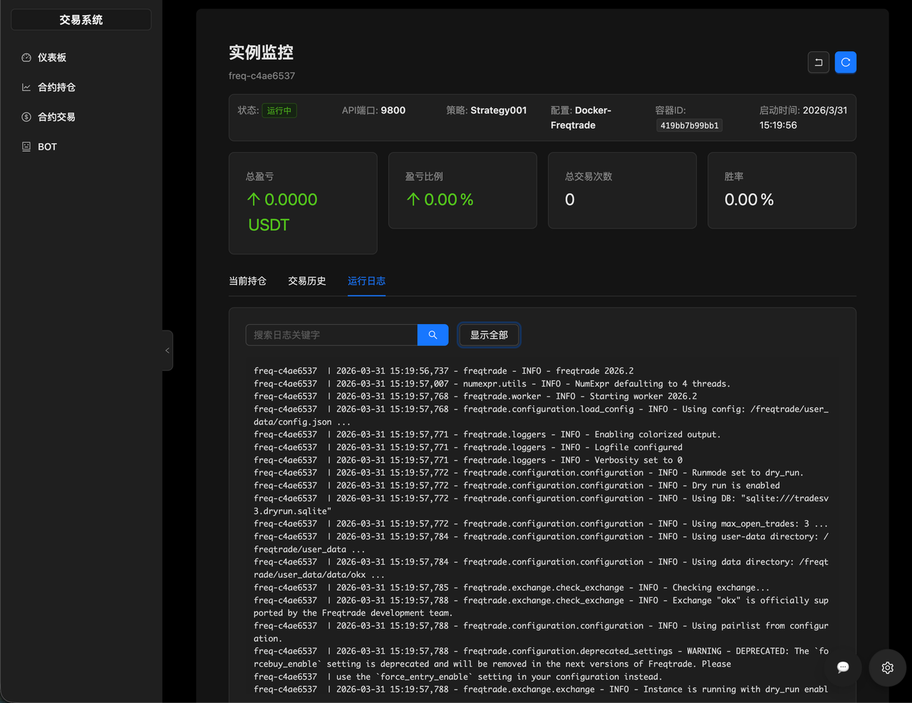

# 量化框架

系统通过集成freqtrade框架提供加密量化功能。

## 访问入口

**Freqtrade配置**: `/system/freqtrade-config`
**策略配置**： `/system/strategy-config`
**策略执行**： `/system/strategy-execution`
**策略回测**： `/system/backtest`

## 使用步骤

- 创建freqtrade配置，支持docker和进程模式(推荐使用docker模式)

用户数据目录必须配置为具备读写权限的目录
- 创建策略

目前仅支持python代码(后续版本会增加ai辅助)
- 执行回测
 
 在策略户回测任务“新建回测任务”面板选择相应的配置、策略、K线周期和时间范围，点击启动回测，系统将开启回测任务。

 任务启动后，页面下方的回测任务列表会展示回测任务。

 回测任务完成后，列表会展示策略的回测概览。

 点击操作列的查看报告按钮，可以展示回测任务的详情(交易明细，资金图表，任务日志等)
- 执行模拟交易/实盘

  在策略执行管理页面的“启动新策略”面板，选择API Key、Freqtrade配置、策略、模拟/实盘，点击“启动策略”即可启动相应策略的模拟/实盘交易

  在“运行实例列表”可以查看正在运行的策略实例(列表同时会展示已经停止的策略，停止的策略可以点击启动，重新执行)。

  在列表操作列点击“监控”按钮，可以进入监控查看页面，切换“当前持仓”，“交易历史”，“运行日志”tab，可以分别查看不同的监控项。

